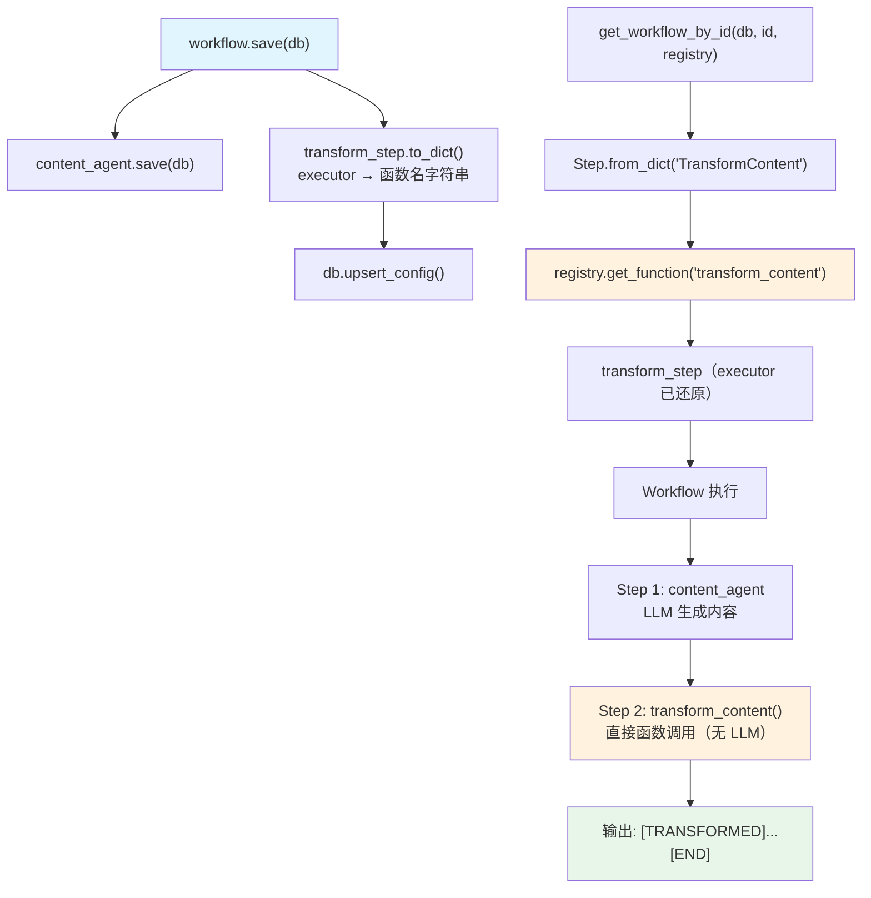

# save_custom_steps.py — 实现原理分析

> 源文件：`cookbook/93_components/workflows/save_custom_steps.py`

## 概述

本示例展示 Agno 的 **`自定义 Executor 步骤序列化`** 机制：Workflow Step 可使用自定义 Python 函数（而非 Agent）作为执行器，该函数同样不可直接序列化，通过 Registry 注册函数名并在加载时还原。

**核心配置一览：**

| 配置项 | 值 | 说明 |
|--------|------|------|
| `workflow.name` | `"Custom Executor Workflow"` | Workflow 名称 |
| `content_step.agent` | `content_agent` | Agent 驱动的步骤 |
| `transform_step.executor` | `transform_content` | 自定义函数驱动的步骤（需 Registry） |
| `registry.functions` | `[transform_content]` | 注册 executor 函数 |

## 架构分层

```
用户代码层                      序列化/还原层
┌──────────────────────┐    ┌──────────────────────────────────────────┐
│ save_custom_steps.py │    │ 保存：                                   │
│                      │    │  Step.to_dict()                          │
│ transform_step =     │    │   → {executor: "transform_content"}      │
│   Step(              │    │   （函数名字符串）                        │
│     executor=        │───>│                                           │
│       transform_     │    │ 还原：                                   │
│       content        │    │  Step.from_dict(data, registry=registry) │
│   )                  │    │   → registry.get_function("transform_...") │
│                      │    │   → 还原 executor callable               │
└──────────────────────┘    └──────────────────────────────────────────┘
```

## 核心组件解析

### executor 函数签名

自定义 executor 函数必须接受 `StepInput` 并返回 `StepOutput`：

```python
from agno.workflow.types import StepInput, StepOutput

def transform_content(step_input: StepInput) -> StepOutput:
    """Custom executor function that transforms content."""
    # step_input.previous_step_content：上一步骤的输出
    previous_content = step_input.previous_step_content or ""
    transformed = f"[TRANSFORMED] {previous_content} [END]"
    return StepOutput(
        step_name="TransformContent",
        content=transformed,
        success=True,
    )
```

### Step.executor vs Step.agent

Step 支持两种执行模式：

| 字段 | 执行方式 | 序列化方式 |
|------|---------|----------|
| `agent` | 调用 Agent._run()（LLM 推理） | 存 agent_id，按版本加载 |
| `executor` | 直接调用 Python 函数 | 存函数名字符串，Registry 还原 |

两者互斥，`executor` 优先于 `agent`（若同时设置）。

### StepInput 数据流

```python
# StepInput 在步骤间传递上下文
@dataclass
class StepInput:
    input: Optional[str]                    # Workflow 初始输入
    previous_step_content: Optional[str]    # 上一步骤的输出内容
    previous_step_outputs: List[StepOutput] # 所有前置步骤输出
    session_state: Dict[str, Any]           # 共享状态
```

`transform_content` 通过 `step_input.previous_step_content` 获取 `content_step`（Agent 步骤）的输出，进行二次处理。

### Registry 注册普通函数

```python
registry = Registry(
    name="Custom Steps Registry",
    functions=[transform_content],  # 注册为普通函数（非工具）
)
```

与工具（`tools` 字段）不同，`functions` 字段中的函数不会暴露为 Agent 的工具选项，而是专门用于 Workflow Step executor 的还原。

### 序列化存储内容

```python
# transform_step.to_dict() 存储内容（简化）
{
    "name": "TransformContent",
    "description": "Transform the content using custom function",
    "agent": None,
    "executor": "transform_content",  # 函数名字符串
}
```

## System Prompt 组装

Workflow 第一步（content_step）使用 Agent，有 LLM 推理；第二步（transform_step）使用自定义函数，无 LLM 调用。

| 步骤 | 执行方式 | System Prompt |
|-----|---------|--------------|
| CreateContent | content_agent（LLM） | `instructions="Create well-structured content from input data"` |
| TransformContent | transform_content（函数） | 无（不调用 LLM） |

## 完整 API 请求

```python
# 步骤1：content_agent（Agent 步骤，调用 LLM）
client.chat.completions.create(
    model="gpt-4o-mini",
    messages=[
        {"role": "system", "content": "Create well-structured content from input data"},
        {"role": "user", "content": "Write about AI trends"}
    ],
    stream=True,
)

# 步骤2：transform_content（自定义函数，不调用 LLM）
# 直接执行：transform_content(step_input) → StepOutput
# "[TRANSFORMED] <content_agent输出> [END]"
```

## Mermaid 流程图



## 关键源码文件索引

| 文件 | 关键函数/类 | 作用 |
|------|------------|------|
| `agno/workflow/step.py` | `Step.executor` | 自定义函数执行器字段 |
| `agno/workflow/step.py` | `Step.to_dict()` | executor → 函数名字符串 |
| `agno/workflow/step.py` | `Step.from_dict()` | 函数名 → callable 还原 |
| `agno/workflow/types.py` | `StepInput` | executor 函数输入类型 |
| `agno/workflow/types.py` | `StepOutput` | executor 函数返回类型 |
| `agno/registry/registry.py` | `get_function()` L81 | 按名还原 executor 函数 |
