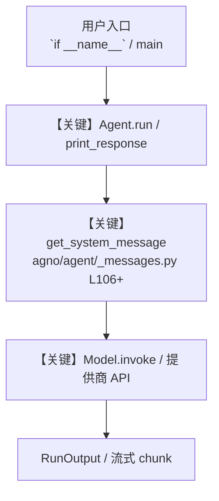

# save_custom_steps.py — 实现原理分析

<!-- cookbook-py-source:start -->
## 完整源码

```python
"""
Save Custom Executor Workflow Steps
===================================

Demonstrates creating a workflow with custom executor steps, saving it to the
database, and loading it back with a Registry.
"""

from agno.agent import Agent
from agno.db.postgres import PostgresDb
from agno.registry import Registry
from agno.workflow.step import Step
from agno.workflow.types import StepInput, StepOutput
from agno.workflow.workflow import Workflow, get_workflow_by_id

# ---------------------------------------------------------------------------
# Setup
# ---------------------------------------------------------------------------
# Database
db_url = "postgresql+psycopg://ai:ai@localhost:5532/ai"
db = PostgresDb(db_url=db_url)

# ---------------------------------------------------------------------------
# Create Agents
# ---------------------------------------------------------------------------
# Agents
content_agent = Agent(
    name="Content Creator",
    instructions="Create well-structured content from input data",
)


# ---------------------------------------------------------------------------
# Create Registry Components
# ---------------------------------------------------------------------------
# Custom executor function (will be serialized by name and restored via registry)
def transform_content(step_input: StepInput) -> StepOutput:
    """Custom executor function that transforms content."""
    previous_content = step_input.previous_step_content or ""
    transformed = f"[TRANSFORMED] {previous_content} [END]"
    print("Transform: Applied transformation to content")
    return StepOutput(
        step_name="TransformContent",
        content=transformed,
        success=True,
    )


# Registry (required to restore the executor function when loading)
registry = Registry(
    name="Custom Steps Registry",
    functions=[transform_content],
)

# ---------------------------------------------------------------------------
# Create Workflow Steps
# ---------------------------------------------------------------------------
# Steps
content_step = Step(
    name="CreateContent",
    description="Create initial content using the agent",
    agent=content_agent,
)

transform_step = Step(
    name="TransformContent",
    description="Transform the content using custom function",
    executor=transform_content,
)

# ---------------------------------------------------------------------------
# Create Workflow
# ---------------------------------------------------------------------------
# Workflow
workflow = Workflow(
    name="Custom Executor Workflow",
    description="Create content with agent, then transform with custom function",
    steps=[
        content_step,
        transform_step,
    ],
    db=db,
)

# ---------------------------------------------------------------------------
# Run Workflow Example
# ---------------------------------------------------------------------------
if __name__ == "__main__":
    # Save
    print("Saving workflow...")
    version = workflow.save(db=db)
    print(f"Saved workflow as version {version}")

    # Load
    print("\nLoading workflow...")
    loaded_workflow = get_workflow_by_id(
        db=db,
        id="custom-executor-workflow",
        registry=registry,
    )

    if loaded_workflow:
        print("Workflow loaded successfully!")
        print(f"  Name: {loaded_workflow.name}")
        print(f"  Steps: {len(loaded_workflow.steps) if loaded_workflow.steps else 0}")

        # Uncomment to run the loaded workflow
        # loaded_workflow.print_response(input="Write about AI trends", stream=True)
    else:
        print("Workflow not found")
```

<!-- cookbook-py-source:end -->

> 源文件：`cookbook/93_components/workflows/save_custom_steps.py`

## 概述

Save Custom Executor Workflow Steps

本示例归类：**Workflow**；模型相关类型：`（见源码 import）`。

**核心配置一览：**

| 配置项 | 值 | 说明 |
|--------|------|------|
| `name` | 'Content Creator' | `Agent(...)` |
| `instructions` | 'Create well-structured content from input data' | `Agent(...)` |

## 架构分层

```
用户 / cookbook 示例              Agno 框架
┌──────────────────────┐         ┌────────────────────────────────┐
│ save_custom_steps.py │  ──▶  │ Agent → get_run_messages → Model │
└──────────────────────┘         └────────────────────────────────┘
                                          │
                                          ▼
                                  ┌───────────────┐
                                  │ 对应 Model 子类 │
                                  └───────────────┘
```

## 核心组件解析

### 运行机制与因果链

1. **入口**：从模块 `__main__` 或暴露的 `agent` / `team` 调用进入；同步用 `print_response` / `run`，异步用 `aprint_response` / `arun`（若源码中有）。
2. **消息**：默认路径下 system 内容由 `get_system_message()`（`libs/agno/agno/agent/_messages.py` 约 **L106** 起）按分段逻辑拼装；若显式传入 `system_message` 则早退使用该字符串。
3. **模型**：具体 HTTP/SDK 形态以 `libs/agno/agno/models/` 下对应类的 `invoke` / `ainvoke` 为准（勿默认写成单一 `chat.completions`）。
4. **副作用**：若配置 `db`、`knowledge`、`memory`，运行会读写存储；仅以本文件为准对照。

### 与框架的衔接

- **System**：`get_system_message()` 锚点 `agno/agent/_messages.py` **L106+**。
- **运行**：`Agent.print_response` 等入口 `agno/agent/agent.py`（以当前仓库检索为准）。

## System Prompt 组装

| 序号 | 组成部分 | 本文件 | 是否生效 |
|------|---------|--------|---------|
| 1 | `instructions` / `description` 等 | 见核心配置表与源码 | 有赋值则生效 |
| 2 | 默认分段（markdown、时间等） | 取决于 `Agent` 默认与显式参数 | 视参数 |

### 拼装顺序与源码锚点

1. `system_message` 直给 → 使用该内容（见 `_messages.py` 文档字符串分支说明）。
2. 否则默认拼装：`description`、`role`、`instructions`、markdown 附加段等按 `# 3.x` 注释顺序合并。

### 还原后的完整 System 文本

```text
--- instructions ---
Create well-structured content from input data
```

### 段落释义（模型视角）

- 指令与安全边界由 `instructions` / `system_message` 约束；若带 `tools` / `knowledge`，文档中需体现「何时检索/调用」由框架注入的提示段支持。

## 完整 API 请求

```python
# 请以本文件实际 Model 为准打开 libs/agno/agno/models/<厂商>/ 下对应类的 invoke：
# 可能是 chat.completions.create、responses.create、Gemini generate_content 等。
```

> 与上一节 system 文本在同一 run 中组合；`developer`/`system` 角色由适配器转换。


```mermaid
flowchart TD
    Entry["用户入口<br/>`if __name__` / main"] --> Run["【关键】Agent.run / print_response"]
    Run --> Sys["【关键】get_system_message<br/>agno/agent/_messages.py L106+"]
    Sys --> Inv["【关键】Model.invoke / 提供商 API"]
    Inv --> Out["RunOutput / 流式 chunk"]
```

**【关键】节点说明：**

- **print_response / run**：用户可见的同步入口。
- **get_system_message**：系统提示拼装核心。
- **Model.invoke**：对模型提供商的实际请求。

## 关键源码文件索引

| 文件 | 作用 |
|------|------|
| `agno/agent/_messages.py` | `get_system_message()` L106+ |
| `agno/agent/agent.py` | `Agent` 运行与 CLI 输出 |
| `agno/models/` | 各厂商 `Model.invoke` |
