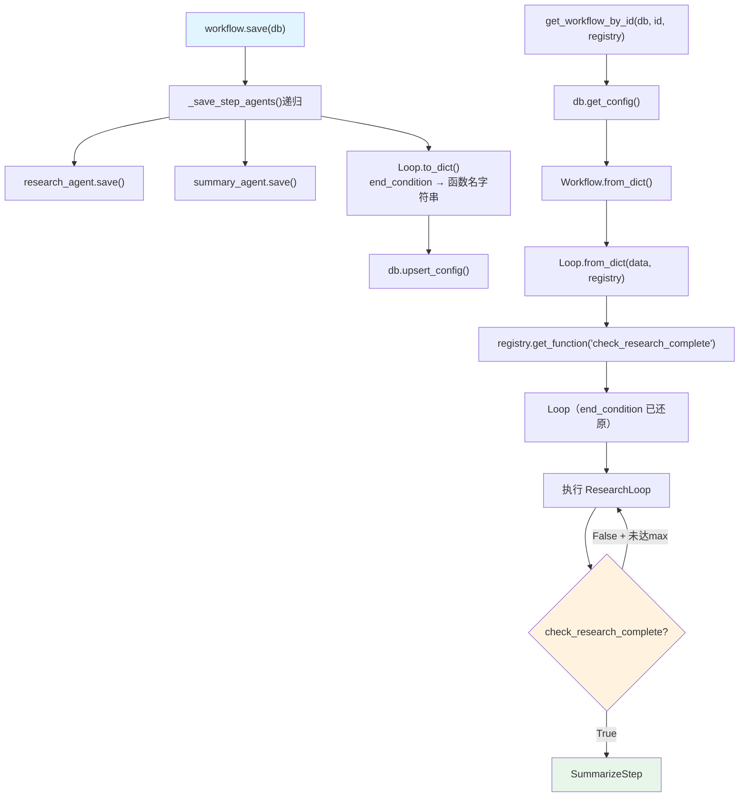

# save_loop_steps.py — 实现原理分析

> 源文件：`cookbook/93_components/workflows/save_loop_steps.py`

## 概述

本示例展示 Agno 的 **`Loop 步骤序列化与还原`** 机制：将包含 Loop 容器步骤的 Workflow 保存到 PostgreSQL，其中 Loop 的 `end_condition` 是 Python 函数（不可直接序列化），通过 Registry 注册该函数并在加载时按函数名还原。

**核心配置一览：**

| 配置项 | 值 | 说明 |
|--------|------|------|
| `workflow.name` | `"Loop Research Workflow"` | Workflow 名称 |
| `workflow.steps` | `[Loop(...), summarize_step]` | 包含 Loop 容器 |
| `Loop.name` | `"ResearchLoop"` | Loop 容器名称 |
| `Loop.end_condition` | `check_research_complete` | Python 函数（需 Registry 还原） |
| `Loop.max_iterations` | `3` | 最大循环次数 |
| `Loop.steps` | `[research_step]` | Loop 内步骤 |
| `registry.functions` | `[check_research_complete]` | 注册 end_condition 函数 |
| `research_agent.tools` | `[HackerNewsTools(), WebSearchTools()]` | 研究工具 |

## 架构分层

```
用户代码层                    序列化/还原层
┌──────────────────┐    ┌──────────────────────────────────────────┐
│ save_loop_steps  │    │ 保存：                                   │
│ .py              │    │  Loop.to_dict()                          │
│                  │    │   → {end_condition: "check_research_..."}│
│ workflow.save()  │───>│   （函数名字符串，非函数引用）            │
│                  │    │                                           │
│ get_workflow_    │    │ 还原：                                   │
│   by_id(         │    │  Loop.from_dict(data, registry=registry) │
│     registry=    │───>│   → registry.get_function(func_name)    │
│       registry   │    │   → 还原 end_condition callable          │
│   )              │    └──────────────────────────────────────────┘
└──────────────────┘
```

## 核心组件解析

### Loop 容器

`Loop` 是 Workflow 的步骤容器类型，循环执行 `steps` 直到 `end_condition` 返回 `True` 或达到 `max_iterations`：

```python
from agno.workflow.loop import Loop

Loop(
    name="ResearchLoop",
    description="Loop through research until end condition is met",
    steps=[research_step],          # 循环执行的步骤列表
    end_condition=check_research_complete,  # 返回 True 时停止
    max_iterations=3,               # 最多循环 3 次
)
```

### end_condition 序列化

`check_research_complete` 是普通 Python 函数，接受 `List[StepOutput]` 返回 `bool`：

```python
def check_research_complete(outputs: List[StepOutput]) -> bool:
    """Returns True to break the loop, False to continue."""
    for output in outputs:
        if output.content and len(output.content) > 500:
            return True  # 内容足够丰富 → 停止循环
    return False  # 内容不足 → 继续循环
```

`Loop.to_dict()` 将此函数序列化为函数名字符串：

```python
# Loop.to_dict() 存储的内容（简化）
{
    "type": "loop",
    "name": "ResearchLoop",
    "max_iterations": 3,
    "end_condition": "check_research_complete",  # 函数名字符串
    "steps": [...]
}
```

### Registry 还原 end_condition

加载时 `Loop.from_dict()` 通过 Registry 还原函数：

```python
# Loop.from_dict()（简化）
def from_dict(data, registry=None, ...):
    end_condition_name = data.get("end_condition")
    end_condition = None
    if end_condition_name and registry:
        end_condition = registry.get_function(end_condition_name)
        # registry.get_function("check_research_complete")
        # → 返回原始 callable

    return Loop(
        end_condition=end_condition,  # 还原的函数引用
        ...
    )
```

**若无 Registry**：`end_condition` 将为 `None`，Loop 无法判断停止条件，会一直运行到 `max_iterations`。

### 完整保存/加载流程

```python
# 保存
version = workflow.save(db=db)  # 递归保存 research_agent + summary_agent

# 加载（需传入 registry 以还原 end_condition）
loaded_workflow = get_workflow_by_id(
    db=db,
    id="loop-research-workflow",
    registry=registry,  # 包含 check_research_complete 函数
)
```

## System Prompt 组装

各 Agent 在 Workflow 执行时组装 system prompt，research_agent 的 `instructions` 生效：

| 序号 | 组成部分 | research_agent 值 | 是否生效 |
|------|---------|-----------------|---------|
| 3.1 | `instructions` | `"Research the given topic thoroughly using available tools"` | 是 |
| 3.3.13 | `search_knowledge` instructions | 无 knowledge | 否 |
| 3.3.5 | `_tool_instructions` | HackerNewsTools + WebSearchTools | 是 |

## 完整 API 请求

```python
# Loop 第 1 次迭代：research_agent 请求
client.chat.completions.create(
    model="gpt-4o-mini",
    messages=[
        {"role": "system", "content": "Research the given topic thoroughly using available tools"},
        {"role": "user", "content": "Latest developments in AI agents"}
    ],
    tools=[
        {"type": "function", "function": {"name": "get_top_hackernews_stories", ...}},
        {"type": "function", "function": {"name": "web_search", ...}},
    ],
    stream=True,
)
# → check_research_complete(outputs) → True/False
# → True → 退出 Loop → summary_agent 执行
```

## Mermaid 流程图



## 关键源码文件索引

| 文件 | 关键函数/类 | 作用 |
|------|------------|------|
| `agno/workflow/loop.py` | `Loop` | Loop 容器类 |
| `agno/workflow/loop.py` | `Loop.to_dict()` | end_condition → 函数名序列化 |
| `agno/workflow/loop.py` | `Loop.from_dict()` | 函数名 → callable 还原 |
| `agno/workflow/types.py` | `StepOutput` | Loop end_condition 参数类型 |
| `agno/registry/registry.py` | `get_function()` L81 | 按名还原普通函数 |
| `agno/workflow/workflow.py` | `get_workflow_by_id()` L7433 | 加载入口（传 registry） |
