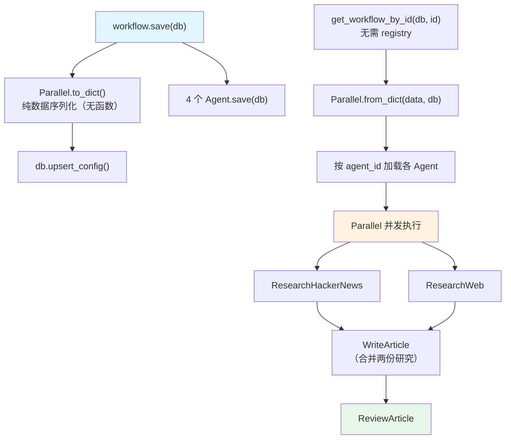

# save_parallel_steps.py — 实现原理分析

> 源文件：`cookbook/93_components/workflows/save_parallel_steps.py`

## 概述

本示例展示 Agno 的 **`Parallel 步骤序列化`** 机制：Parallel 容器将多个步骤并发执行，其本身无自定义函数，可以直接序列化/还原，**无需 Registry**。这是 Workflow 步骤容器中序列化最简单的类型。

**核心配置一览：**

| 配置项 | 值 | 说明 |
|--------|------|------|
| `workflow.name` | `"Parallel Research Pipeline"` | Workflow 名称 |
| `Parallel` | `(research_hn_step, research_web_step)` | 并行执行两个步骤 |
| `Parallel.name` | `"ParallelResearch"` | Parallel 容器名称 |
| `write_step.agent` | `writer` | 写作步骤 |
| `review_step.agent` | `reviewer` | 审校步骤 |
| `registry` | 无需 | Parallel 无自定义函数 |

## 架构分层

```
用户代码层                    序列化层（无需还原）
┌──────────────────────┐    ┌────────────────────────────────────────┐
│ save_parallel_steps  │    │ Parallel.to_dict()                    │
│ .py                  │    │  → {type: "parallel",                  │
│                      │    │     name: "ParallelResearch",          │
│ Parallel(            │───>│     steps: [                           │
│   research_hn_step,  │    │       {name: "ResearchHackerNews",     │
│   research_web_step, │    │        agent_id: "..."},               │
│   name="Parallel...",│    │       {name: "ResearchWeb",            │
│ )                    │    │        agent_id: "..."}                │
│                      │    │     ]}                                  │
└──────────────────────┘    └────────────────────────────────────────┘
```

## 核心组件解析

### Parallel 容器

```python
from agno.workflow.parallel import Parallel

Parallel(
    research_hn_step,    # 位置参数（步骤列表）
    research_web_step,
    name="ParallelResearch",
    description="Run HackerNews and Web research in parallel",
)
```

Parallel 内部步骤通过线程池或 asyncio 并发执行，各步骤独立运行，结果合并后传给下一步。

### 为何 Parallel 不需要 Registry

Parallel 自身不包含任何 Python 函数引用：
- 内部步骤通过 `agent_id` 引用 Agent（从 DB 加载）
- 无 `selector`/`evaluator`/`end_condition` 等函数字段

```python
# Parallel.to_dict()（完全可序列化）
{
    "type": "parallel",
    "name": "ParallelResearch",
    "description": "Run HackerNews and Web research in parallel",
    "steps": [
        {"name": "ResearchHackerNews", "agent_id": "hackernews-researcher"},
        {"name": "ResearchWeb", "agent_id": "web-researcher"},
    ]
}
```

加载时 `Parallel.from_dict()` 只需 `db` 参数即可还原，无需 `registry`：

```python
loaded_workflow = get_workflow_by_id(db=db, id="parallel-research-pipeline")
# 注意：无 registry 参数
```

### 各容器序列化复杂度对比

| 容器类型 | 自定义函数 | 需要 Registry | 序列化复杂度 |
|---------|---------|-------------|------------|
| `Parallel` | 无 | 否 | 低（纯数据） |
| `Condition` | `evaluator` | 是 | 中 |
| `Loop` | `end_condition` | 是 | 中 |
| `Router` | `selector` | 是 | 中 |
| `Step(executor=fn)` | `executor` | 是 | 中 |

### 完整 Pipeline 流程

```
步骤1: ParallelResearch（并行）
  ├── ResearchHackerNews（hackernews_researcher）→ HN 研究结果
  └── ResearchWeb（web_researcher）→ Web 研究结果

步骤2: WriteArticle（writer）→ 融合两份研究撰写文章

步骤3: ReviewArticle（reviewer）→ 审校并完善文章
```

并行步骤的输出通过 `StepInput.previous_step_outputs` 传递给后续步骤，writer Agent 可访问两个并行步骤的结果。

## System Prompt 组装

4 个 Agent 各自的 system prompt 由 `instructions` 触发：

| Agent | instructions | tools |
|-------|-------------|-------|
| hackernews_researcher | `"Research tech news and trends from Hacker News"` | HackerNewsTools |
| web_researcher | `"Research general information from the web"` | WebSearchTools |
| writer | `"Write well-structured content from research findings"` | 无 |
| reviewer | `"Review and improve the written content"` | 无 |

## 完整 API 请求

```python
# 并行执行（同时发出两个请求）：

# ResearchHackerNews
client.chat.completions.create(
    model="gpt-4o-mini",
    messages=[
        {"role": "system", "content": "Research tech news and trends from Hacker News"},
        {"role": "user", "content": "Latest developments in AI agents"}
    ],
    tools=[{"type": "function", "function": {"name": "get_top_hackernews_stories", ...}}],
    stream=True,
)

# ResearchWeb（同时）
client.chat.completions.create(
    model="gpt-4o-mini",
    messages=[
        {"role": "system", "content": "Research general information from the web"},
        {"role": "user", "content": "Latest developments in AI agents"}
    ],
    tools=[{"type": "function", "function": {"name": "web_search", ...}}],
    stream=True,
)

# WriteArticle（等待并行步骤完成后）
client.chat.completions.create(
    model="gpt-4o-mini",
    messages=[
        {"role": "system", "content": "Write well-structured content from research findings"},
        {"role": "user", "content": "...HN研究结果 + Web研究结果合并..."}
    ],
    stream=True,
)
```

## Mermaid 流程图



## 关键源码文件索引

| 文件 | 关键函数/类 | 作用 |
|------|------------|------|
| `agno/workflow/parallel.py` | `Parallel` | 并行步骤容器类 |
| `agno/workflow/parallel.py` | `Parallel.to_dict()` | 纯数据序列化（无函数引用） |
| `agno/workflow/parallel.py` | `Parallel.from_dict()` | 从 dict 还原（仅需 db） |
| `agno/workflow/types.py` | `StepOutput` | 并行步骤输出（合并传给下一步） |
| `agno/workflow/workflow.py` | `get_workflow_by_id()` L7433 | 加载入口（无需 registry） |
