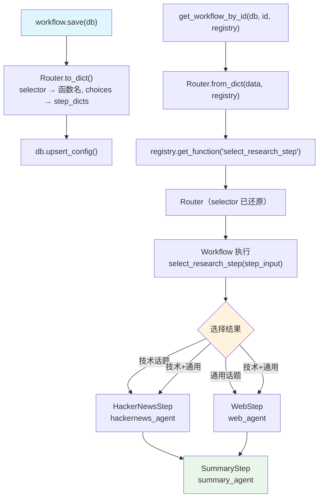

# save_router_steps.py — 实现原理分析

> 源文件：`cookbook/93_components/workflows/save_router_steps.py`

## 概述

本示例展示 Agno 的 **`Router 步骤序列化`** 机制：Router 容器通过 `selector` 函数动态选择要执行的步骤列表，selector 函数同样通过 Registry 按名序列化和还原。与 Condition（是/否）不同，Router 支持多路动态路由。

**核心配置一览：**

| 配置项 | 值 | 说明 |
|--------|------|------|
| `workflow.name` | `"Router Research Workflow"` | Workflow 名称 |
| `Router.selector` | `select_research_step` | 路由选择函数（需 Registry） |
| `Router.choices` | `[hackernews_step, web_step]` | 所有候选步骤 |
| `registry.functions` | `[select_research_step]` | 注册 selector 函数 |
| `hackernews_agent.tools` | `[HackerNewsTools()]` | 技术新闻工具 |
| `web_agent.tools` | `[WebSearchTools()]` | 通用搜索工具 |

## 架构分层

```
用户代码层                      序列化/还原层
┌──────────────────────┐    ┌──────────────────────────────────────────┐
│ save_router_steps.py │    │ 保存：                                   │
│                      │    │  Router.to_dict()                        │
│ Router(              │    │   → {selector: "select_research_step",   │
│   selector=          │───>│      choices: [step_dict, step_dict]}    │
│     select_research_ │    │                                           │
│     step,            │    │ 还原：                                   │
│   choices=[hn, web]  │    │  Router.from_dict(data, registry)        │
│ )                    │    │   → registry.get_function(selector_name) │
└──────────────────────┘    └──────────────────────────────────────────┘
```

## 核心组件解析

### Router 容器

```python
from agno.workflow.router import Router

Router(
    name="ResearchRouter",
    description="Route to appropriate research agent based on topic",
    selector=select_research_step,    # 返回 List[Step]
    choices=[hackernews_step, web_step],  # 所有候选步骤（for_dict 序列化用）
)
```

`choices` 字段存储所有候选步骤，序列化时作为参照；实际执行哪些步骤由 `selector` 的返回值决定。

### selector 函数签名

```python
from typing import List
from agno.workflow.types import StepInput
from agno.workflow.step import Step

def select_research_step(step_input: StepInput) -> List[Step]:
    """Dynamically select which research step(s) to execute based on the input."""
    topic = step_input.input or step_input.previous_step_content or ""
    topic_lower = topic.lower()

    selected_steps = []
    if any(kw in topic_lower for kw in ["ai", "tech", "programming"]):
        selected_steps.append(hackernews_step)  # 技术话题 → HackerNews

    if not selected_steps or "general" in topic_lower:
        selected_steps.append(web_step)  # 通用话题或无匹配 → Web 搜索

    return selected_steps  # 可返回多个步骤（并行/顺序执行）
```

注意：selector 函数直接引用了模块级的 Step 实例（`hackernews_step`、`web_step`），这些对象在加载后由 Registry 提供。

### Condition vs Router 的关键区别

| 特性 | Condition | Router |
|------|---------|-------|
| 判断函数返回类型 | `bool` | `List[Step]` |
| 执行结果 | 执行或跳过固定步骤组 | 执行动态选择的步骤列表 |
| 多路分支 | 否（二选一） | 是（可返回 0-N 个步骤） |
| 候选步骤声明 | `steps`（执行时使用） | `choices`（序列化参照） |

### 序列化存储

```python
# Router.to_dict()
{
    "type": "router",
    "name": "ResearchRouter",
    "selector": "select_research_step",  # 函数名字符串
    "choices": [
        {"name": "HackerNewsStep", "agent_id": "..."},
        {"name": "WebStep", "agent_id": "..."},
    ]
}
```

## System Prompt 组装

Router 执行时调用 selector 选择步骤，无 LLM 推理；被选中的 Agent 步骤各自组装 system prompt。

| Agent | instructions | tools | 触发条件 |
|-------|-------------|-------|---------|
| hackernews_agent | `"Research tech news..."` | HackerNewsTools | 技术话题 |
| web_agent | `"Research general information..."` | WebSearchTools | 非技术话题或 fallback |
| summary_agent | `"Summarize the research findings..."` | 无 | 始终执行 |

## 完整 API 请求

```python
# 技术话题：Router 选择 HackerNews 步骤
client.chat.completions.create(
    model="gpt-4o-mini",
    messages=[
        {"role": "system", "content": "Research tech news and trends from Hacker News"},
        {"role": "user", "content": "Latest developments in AI agents"}
    ],
    tools=[{"type": "function", "function": {"name": "get_top_hackernews_stories", ...}}],
    stream=True,
)

# 最后的 summary_agent（无论哪条路径都执行）
client.chat.completions.create(
    model="gpt-4o-mini",
    messages=[
        {"role": "system", "content": "Summarize the research findings into a concise report"},
        {"role": "user", "content": "...前置步骤输出..."}
    ],
    stream=True,
)
```

## Mermaid 流程图



## 关键源码文件索引

| 文件 | 关键函数/类 | 作用 |
|------|------------|------|
| `agno/workflow/router.py` | `Router` | 多路路由容器类 |
| `agno/workflow/router.py` | `Router.to_dict()` | selector → 函数名字符串 |
| `agno/workflow/router.py` | `Router.from_dict()` | 函数名 → callable 还原 |
| `agno/workflow/types.py` | `StepInput` | selector 函数参数类型 |
| `agno/registry/registry.py` | `get_function()` L81 | 按名还原 selector |
