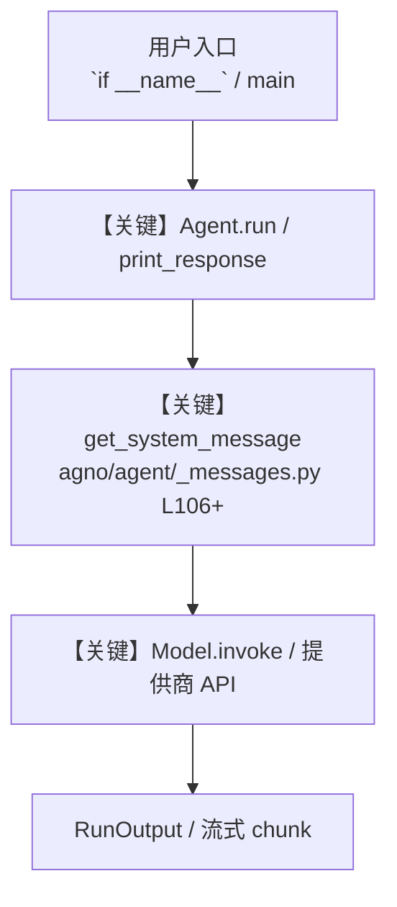

# 16_prompt_caching.py — 实现原理分析

<!-- cookbook-py-source:start -->
## 完整源码

```python
"""
Prompt Caching - Save Tokens on Repeated Queries
==================================================
Cache large documents server-side so repeated queries skip the full token cost.

Key concepts:
- genai.Client().caches.create: Creates a server-side cache with TTL
- cached_content: Links the cache to your Gemini model
- TTL: Time-to-live for the cache (e.g., "300s" = 5 minutes)
- Token savings: Subsequent queries skip the cached content's token cost

Example prompts to try:
- "Find a lighthearted moment from this transcript"
- "What was the most tense moment during the mission?"
- "Summarize the key decisions made"
"""

from pathlib import Path
from time import sleep

import requests
from agno.agent import Agent
from agno.models.google import Gemini
from google import genai
from google.genai.types import UploadFileConfig

WORKSPACE = Path(__file__).parent.joinpath("workspace")
WORKSPACE.mkdir(parents=True, exist_ok=True)

# ---------------------------------------------------------------------------
# Download and upload the source document
# ---------------------------------------------------------------------------
client = genai.Client()

# Download a large text file (Apollo 11 transcript, ~100K tokens)
txt_url = "https://storage.googleapis.com/generativeai-downloads/data/a11.txt"
txt_path = WORKSPACE / "a11.txt"

if not txt_path.exists():
    print("Downloading transcript...")
    with txt_path.open("wb") as f:
        resp = requests.get(txt_url, stream=True)
        for chunk in resp.iter_content(chunk_size=32768):
            f.write(chunk)

# Upload to Google (get-or-create pattern)
remote_name = "files/a11"
txt_file = None
try:
    txt_file = client.files.get(name=remote_name)
    print(f"File already uploaded: {txt_file.uri}")
except Exception:
    pass

if not txt_file:
    print("Uploading file...")
    txt_file = client.files.upload(
        file=txt_path,
        config=UploadFileConfig(name=remote_name),
    )
    while txt_file and txt_file.state and txt_file.state.name == "PROCESSING":
        print("Processing...")
        sleep(2)
        txt_file = client.files.get(name=remote_name)
    print(f"Upload complete: {txt_file.uri}")

# ---------------------------------------------------------------------------
# Create cache
# ---------------------------------------------------------------------------
print("\nCreating cache (5 min TTL)...")
cache = client.caches.create(
    model="gemini-3-flash-preview",
    config={
        "system_instruction": "You are an expert at analyzing transcripts.",
        "contents": [txt_file],
        # Cache expires after 5 minutes, set higher for production
        "ttl": "300s",
    },
)
print(f"Cache created: {cache.name}")

# ---------------------------------------------------------------------------
# Create Agent with cached content
# ---------------------------------------------------------------------------
cache_agent = Agent(
    name="Transcript Analyst",
    # cached_content links the agent to the pre-loaded cache
    model=Gemini(id="gemini-3-flash-preview", cached_content=cache.name),
)

# ---------------------------------------------------------------------------
# Run Agent
# ---------------------------------------------------------------------------
if __name__ == "__main__":
    # Query 1: The full transcript is in the cache, no need to re-send
    run_output = cache_agent.run("Find a lighthearted moment from this transcript")
    print(f"\nResponse:\n{run_output.content}")
    print(f"\nMetrics: {run_output.metrics}")

    # Query 2: Same cache, different question, shows token savings
    run_output = cache_agent.run("What was the most tense moment during the mission?")
    print(f"\nResponse:\n{run_output.content}")
    print(f"\nMetrics: {run_output.metrics}")

# ---------------------------------------------------------------------------
# More Examples
# ---------------------------------------------------------------------------
"""
Prompt caching economics:

- First query: Full token cost (upload + prompt + response)
- Subsequent queries: Only prompt + response tokens (cached content is free)
- For a 100K-token document queried 10 times:
  Without caching: 10 * 100K = 1M input tokens
  With caching: 100K + 10 * (prompt only) = ~110K input tokens

TTL guidelines:
- "300s" (5 min): Development and testing
- "3600s" (1 hour): Interactive sessions
- "86400s" (24 hours): Production batch jobs

Cache limitations:
- Minimum cached content: ~32K tokens
- Maximum TTL varies by model
- Cache is per-model, switching models requires a new cache
"""
```

<!-- cookbook-py-source:end -->

> 源文件：`cookbook/gemini_3/16_prompt_caching.py`

## 概述

Prompt Caching - Save Tokens on Repeated Queries

本示例归类：**单 Agent**；模型相关类型：`Gemini`。

**核心配置一览：**

| 配置项 | 值 | 说明 |
|--------|------|------|
| `name` | 'Transcript Analyst' | `Agent(...)` |
| `model` | Gemini(id='gemini-3-flash-preview'…) | `Agent(...)` |
| （Model 类） | `Gemini` | `agno.models` |

## 架构分层

```
用户 / cookbook 示例              Agno 框架
┌──────────────────────┐         ┌────────────────────────────────┐
│ 16_prompt_caching.py │  ──▶  │ Agent → get_run_messages → Model │
└──────────────────────┘         └────────────────────────────────┘
                                          │
                                          ▼
                                  ┌───────────────┐
                                  │ 对应 Model 子类 │
                                  └───────────────┘
```

## 核心组件解析

### 运行机制与因果链

1. **入口**：从模块 `__main__` 或暴露的 `agent` / `team` 调用进入；同步用 `print_response` / `run`，异步用 `aprint_response` / `arun`（若源码中有）。
2. **消息**：默认路径下 system 内容由 `get_system_message()`（`libs/agno/agno/agent/_messages.py` 约 **L106** 起）按分段逻辑拼装；若显式传入 `system_message` 则早退使用该字符串。
3. **模型**：具体 HTTP/SDK 形态以 `libs/agno/agno/models/` 下对应类的 `invoke` / `ainvoke` 为准（勿默认写成单一 `chat.completions`）。
4. **副作用**：若配置 `db`、`knowledge`、`memory`，运行会读写存储；仅以本文件为准对照。

### 与框架的衔接

- **System**：`get_system_message()` 锚点 `agno/agent/_messages.py` **L106+**。
- **运行**：`Agent.print_response` 等入口 `agno/agent/agent.py`（以当前仓库检索为准）。

## System Prompt 组装

| 序号 | 组成部分 | 本文件 | 是否生效 |
|------|---------|--------|---------|
| 1 | `instructions` / `description` 等 | 见核心配置表与源码 | 有赋值则生效 |
| 2 | 默认分段（markdown、时间等） | 取决于 `Agent` 默认与显式参数 | 视参数 |

### 拼装顺序与源码锚点

1. `system_message` 直给 → 使用该内容（见 `_messages.py` 文档字符串分支说明）。
2. 否则默认拼装：`description`、`role`、`instructions`、markdown 附加段等按 `# 3.x` 注释顺序合并。

### 还原后的完整 System 文本

```text
（主 `Agent(...)` 未传入可静态解析的 `description`/`instructions`/`system_message` 字符串；此时 system 由 `get_system_message()` 默认段与 `markdown` 等开关决定，请在 `agno/agent/_messages.py` 对照分段注释，或在运行中打印 `get_system_message` 返回值。）
```

### 段落释义（模型视角）

- 指令与安全边界由 `instructions` / `system_message` 约束；若带 `tools` / `knowledge`，文档中需体现「何时检索/调用」由框架注入的提示段支持。

## 完整 API 请求

```python
# 请以本文件实际 Model 为准打开 libs/agno/agno/models/<厂商>/ 下对应类的 invoke：
# 可能是 chat.completions.create、responses.create、Gemini generate_content 等。
```

> 与上一节 system 文本在同一 run 中组合；`developer`/`system` 角色由适配器转换。



**【关键】节点说明：**

- **print_response / run**：用户可见的同步入口。
- **get_system_message**：系统提示拼装核心。
- **Model.invoke**：对模型提供商的实际请求。

## 关键源码文件索引

| 文件 | 作用 |
|------|------|
| `agno/agent/_messages.py` | `get_system_message()` L106+ |
| `agno/agent/agent.py` | `Agent` 运行与 CLI 输出 |
| `agno/models/` | 各厂商 `Model.invoke` |
