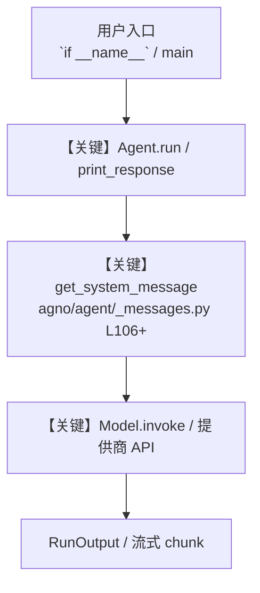

# 17_knowledge.py — 实现原理分析

<!-- cookbook-py-source:start -->
## 完整源码

```python
"""
Knowledge Base + Storage - Recipe Assistant with RAG
=====================================================
Give an agent persistent storage and a searchable knowledge base.

Key concepts:
- Knowledge: A searchable collection of documents stored in a vector database
- search_knowledge=True: Agent automatically searches knowledge before answering
- SqliteDb: Lightweight local database for conversation history (no Postgres needed)
- ChromaDb: Local vector database for embedding and searching documents
- Hybrid search: Combines semantic similarity with keyword matching for better results
- GeminiEmbedder: Uses Gemini's embedding model for vectorizing documents

Example prompts to try:
- "What Thai dishes can I make with chicken and coconut milk?"
- "How about a vegetarian option from the same cookbook?"
- "What desserts do you have in your knowledge base?"
"""

from pathlib import Path

from agno.agent import Agent
from agno.knowledge import Knowledge
from agno.knowledge.embedder.google import GeminiEmbedder
from agno.models.google import Gemini
from agno.vectordb.chroma import ChromaDb, SearchType
from db import gemini_agents_db

WORKSPACE = Path(__file__).parent.joinpath("workspace")
WORKSPACE.mkdir(parents=True, exist_ok=True)

knowledge = Knowledge(
    name="Recipe Knowledge",
    vector_db=ChromaDb(
        collection="thai-recipes",
        path=str(WORKSPACE / "chromadb"),
        persistent_client=True,
        # Hybrid search combines vector similarity + keyword matching
        search_type=SearchType.hybrid,
        embedder=GeminiEmbedder(),
    ),
    # Store metadata about contents in the agent database
    contents_db=gemini_agents_db,
)

# ---------------------------------------------------------------------------
# Agent Instructions
# ---------------------------------------------------------------------------
instructions = """\
You are a recipe assistant with access to a Thai cookbook.

## Workflow

1. Search your knowledge base for relevant recipes
2. Answer the user's question based on what you find
3. Suggest variations or substitutions when appropriate

## Rules

- Always search knowledge before answering
- Mention specific recipe names from the cookbook
- Suggest ingredient substitutions for dietary restrictions\
"""

# ---------------------------------------------------------------------------
# Create Agent
# ---------------------------------------------------------------------------
recipe_agent = Agent(
    name="Recipe Assistant",
    model=Gemini(id="gemini-3-flash-preview"),
    instructions=instructions,
    knowledge=knowledge,
    # Agent automatically searches knowledge when relevant
    search_knowledge=True,
    db=gemini_agents_db,
    # Include last 3 conversation turns for context
    add_history_to_context=True,
    num_history_runs=3,
    add_datetime_to_context=True,
    markdown=True,
)

# ---------------------------------------------------------------------------
# Run Agent
# ---------------------------------------------------------------------------
if __name__ == "__main__":
    # Step 1: Load recipe knowledge into the knowledge base
    print("Loading recipe knowledge...")
    knowledge.insert(
        text_content="""\
## Thai Recipe Collection

### Tom Kha Gai (Chicken Coconut Soup)
Ingredients: chicken breast, coconut milk, galangal, lemongrass, kaffir lime leaves,
fish sauce, lime juice, mushrooms, chili. Creamy and aromatic, balances sour and savory.

### Green Curry (Gaeng Keow Wan)
Ingredients: green curry paste, coconut milk, chicken or tofu, Thai basil, bamboo shoots,
eggplant, fish sauce, palm sugar. Rich and fragrant with a moderate heat level.

### Pad Thai
Ingredients: rice noodles, shrimp or chicken, eggs, bean sprouts, peanuts, lime,
tamarind paste, fish sauce, sugar. The classic Thai stir-fried noodle dish.

### Som Tum (Green Papaya Salad)
Ingredients: green papaya, cherry tomatoes, green beans, peanuts, dried shrimp,
garlic, chili, lime juice, fish sauce, palm sugar. Refreshing and spicy.

### Massaman Curry
Ingredients: massaman curry paste, coconut milk, beef or chicken, potatoes, onions,
peanuts, tamarind, cinnamon, cardamom. A mild, rich curry with Indian influences.

### Mango Sticky Rice (Khao Niew Mamuang)
Ingredients: glutinous rice, ripe mango, coconut milk, sugar, salt.
A beloved Thai dessert, sweet and creamy.
""",
    )

    # Step 2: Ask questions about the recipes
    print("\n--- Session 1: First question ---\n")
    recipe_agent.print_response(
        "What Thai dishes can I make with chicken and coconut milk?",
        user_id="foodie@example.com",
        session_id="session_1",
        stream=True,
    )

    # Step 3: Follow-up in the same session (agent has context)
    print("\n--- Session 1: Follow-up ---\n")
    recipe_agent.print_response(
        "How about a vegetarian option from the same cookbook?",
        user_id="foodie@example.com",
        session_id="session_1",
        stream=True,
    )

# ---------------------------------------------------------------------------
# More Examples
# ---------------------------------------------------------------------------
"""
Loading knowledge from different sources:

1. From a URL
   knowledge.insert(url="https://example.com/docs.pdf")

2. From a local file
   knowledge.insert(path="path/to/document.pdf")

3. From text directly (this example)
   knowledge.insert(text_content="Your content here...")

4. Named content (prevents duplicates)
   knowledge.insert(name="recipes-v1", text_content="...")

Knowledge vs File Search (step 15):

Knowledge (this example):
- Local vector DB (ChromaDb, PgVector)
- You control embedding, chunking, search
- Hybrid search (semantic + keyword)
- Best for: production, large datasets, custom logic

File Search (step 15):
- Fully managed by Google
- Automatic chunking and embedding
- Built-in citations
- Best for: quick prototyping, small datasets
"""
```

<!-- cookbook-py-source:end -->

> 源文件：`cookbook/gemini_3/17_knowledge.py`

## 概述

Knowledge Base + Storage - Recipe Assistant with RAG

本示例归类：**单 Agent**；模型相关类型：`Gemini`。

**核心配置一览：**

| 配置项 | 值 | 说明 |
|--------|------|------|
| `name` | 'Recipe Assistant' | `Agent(...)` |
| `model` | Gemini(id='gemini-3-flash-preview'…) | `Agent(...)` |
| `instructions` | 'You are a recipe assistant with access to a Thai cookbook.\n\n## Workflow\n\n1. Search your knowledge base for relevant r...' | `Agent(...)` |
| `knowledge` | 变量 `knowledge` | `Agent(...)` |
| `search_knowledge` | True | `Agent(...)` |
| `db` | 变量 `gemini_agents_db` | `Agent(...)` |
| `add_history_to_context` | True | `Agent(...)` |
| `num_history_runs` | 3 | `Agent(...)` |
| `add_datetime_to_context` | True | `Agent(...)` |
| `markdown` | True | `Agent(...)` |
| （Model 类） | `Gemini` | `agno.models` |

## 架构分层

```
用户 / cookbook 示例              Agno 框架
┌──────────────────────┐         ┌────────────────────────────────┐
│ 17_knowledge.py      │  ──▶  │ Agent → get_run_messages → Model │
└──────────────────────┘         └────────────────────────────────┘
                                          │
                                          ▼
                                  ┌───────────────┐
                                  │ 对应 Model 子类 │
                                  └───────────────┘
```

## 核心组件解析

### 运行机制与因果链

1. **入口**：从模块 `__main__` 或暴露的 `agent` / `team` 调用进入；同步用 `print_response` / `run`，异步用 `aprint_response` / `arun`（若源码中有）。
2. **消息**：默认路径下 system 内容由 `get_system_message()`（`libs/agno/agno/agent/_messages.py` 约 **L106** 起）按分段逻辑拼装；若显式传入 `system_message` 则早退使用该字符串。
3. **模型**：具体 HTTP/SDK 形态以 `libs/agno/agno/models/` 下对应类的 `invoke` / `ainvoke` 为准（勿默认写成单一 `chat.completions`）。
4. **副作用**：若配置 `db`、`knowledge`、`memory`，运行会读写存储；仅以本文件为准对照。

### 与框架的衔接

- **System**：`get_system_message()` 锚点 `agno/agent/_messages.py` **L106+**。
- **运行**：`Agent.print_response` 等入口 `agno/agent/agent.py`（以当前仓库检索为准）。

## System Prompt 组装

| 序号 | 组成部分 | 本文件 | 是否生效 |
|------|---------|--------|---------|
| 1 | `instructions` / `description` 等 | 见核心配置表与源码 | 有赋值则生效 |
| 2 | 默认分段（markdown、时间等） | 取决于 `Agent` 默认与显式参数 | 视参数 |

### 拼装顺序与源码锚点

1. `system_message` 直给 → 使用该内容（见 `_messages.py` 文档字符串分支说明）。
2. 否则默认拼装：`description`、`role`、`instructions`、markdown 附加段等按 `# 3.x` 注释顺序合并。

### 还原后的完整 System 文本

```text
--- instructions ---
You are a recipe assistant with access to a Thai cookbook.

## Workflow

1. Search your knowledge base for relevant recipes
2. Answer the user's question based on what you find
3. Suggest variations or substitutions when appropriate

## Rules

- Always search knowledge before answering
- Mention specific recipe names from the cookbook
- Suggest ingredient substitutions for dietary restrictions
```

### 段落释义（模型视角）

- 指令与安全边界由 `instructions` / `system_message` 约束；若带 `tools` / `knowledge`，文档中需体现「何时检索/调用」由框架注入的提示段支持。

## 完整 API 请求

```python
# 请以本文件实际 Model 为准打开 libs/agno/agno/models/<厂商>/ 下对应类的 invoke：
# 可能是 chat.completions.create、responses.create、Gemini generate_content 等。
```

> 与上一节 system 文本在同一 run 中组合；`developer`/`system` 角色由适配器转换。



**【关键】节点说明：**

- **print_response / run**：用户可见的同步入口。
- **get_system_message**：系统提示拼装核心。
- **Model.invoke**：对模型提供商的实际请求。

## 关键源码文件索引

| 文件 | 作用 |
|------|------|
| `agno/agent/_messages.py` | `get_system_message()` L106+ |
| `agno/agent/agent.py` | `Agent` 运行与 CLI 输出 |
| `agno/models/` | 各厂商 `Model.invoke` |
