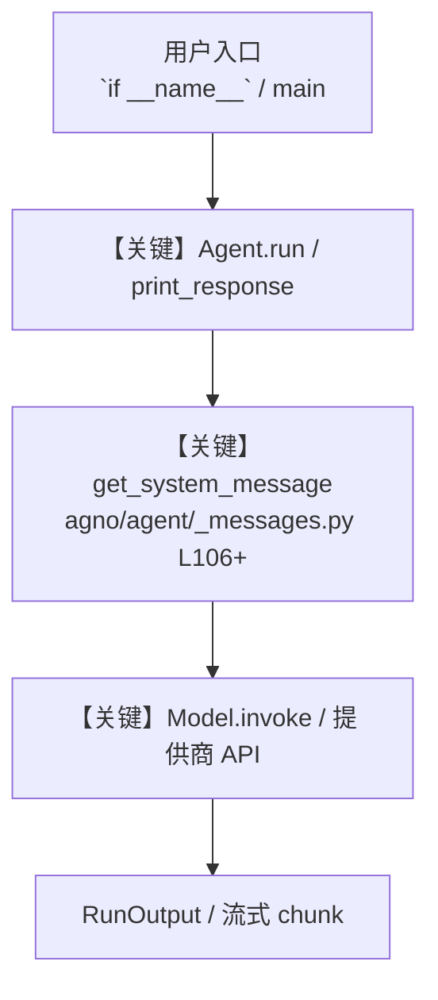

# 18_memory.py — 实现原理分析

<!-- cookbook-py-source:start -->
## 完整源码

```python
"""
Memory + Learning - Agent That Improves Over Time
===================================================
The agent learns from interactions so response 1,000 is better than response 1.

Key concepts:
- LearningMachine: Manages knowledge the agent discovers during conversations
- LearningMode.AGENTIC: Agent decides when to save insights (vs ALWAYS or NEVER)
- enable_agentic_memory: Builds user profiles from conversation patterns
- ReasoningTools: Lets the agent "think" before responding (separate from model thinking)
- Two knowledge stores: Static (docs) + dynamic (learned), searched together

Example prompts to try:
- Session 1: "I'm learning Spanish. I prefer conversations over grammar drills."
- Session 2: "Help me practice asking for directions." (agent remembers preferences)
"""

from pathlib import Path

from agno.agent import Agent
from agno.knowledge import Knowledge
from agno.knowledge.embedder.google import GeminiEmbedder
from agno.learn import LearnedKnowledgeConfig, LearningMachine, LearningMode
from agno.models.google import Gemini
from agno.tools.reasoning import ReasoningTools
from agno.vectordb.chroma import ChromaDb, SearchType
from db import gemini_agents_db

WORKSPACE = Path(__file__).parent.joinpath("workspace")
WORKSPACE.mkdir(parents=True, exist_ok=True)

# ---------------------------------------------------------------------------
# Knowledge: Static docs (teaching materials)
# ---------------------------------------------------------------------------
docs_knowledge = Knowledge(
    name="Tutor Knowledge",
    vector_db=ChromaDb(
        collection="tutor-materials",
        path=str(WORKSPACE / "chromadb"),
        persistent_client=True,
        search_type=SearchType.hybrid,
        embedder=GeminiEmbedder(),
    ),
    contents_db=gemini_agents_db,
)

# ---------------------------------------------------------------------------
# Knowledge: Dynamic learnings (agent discovers over time)
# ---------------------------------------------------------------------------
learned_knowledge = Knowledge(
    vector_db=ChromaDb(
        collection="tutor-learnings",
        path=str(WORKSPACE / "chromadb"),
        persistent_client=True,
        search_type=SearchType.hybrid,
        embedder=GeminiEmbedder(),
    ),
    contents_db=gemini_agents_db,
)

# ---------------------------------------------------------------------------
# Agent Instructions
# ---------------------------------------------------------------------------
instructions = """\
You are a personal language tutor that adapts to each student.

## Workflow

1. Check your learnings and memory for this user's preferences and level
2. Tailor your response to their skill level and learning style
3. Save any new insights about the student for future sessions

## Rules

- Adapt difficulty to the student's level
- Follow the student's preferred learning style
- Track progress and build on previous lessons
- Provide corrections gently with explanations\
"""

# ---------------------------------------------------------------------------
# Create Agent
# ---------------------------------------------------------------------------
tutor_agent = Agent(
    name="Personal Tutor",
    model=Gemini(id="gemini-3-flash-preview"),
    instructions=instructions,
    # ReasoningTools gives the agent a "think" tool for structured reasoning
    tools=[ReasoningTools()],
    knowledge=docs_knowledge,
    search_knowledge=True,
    learning=LearningMachine(
        knowledge=learned_knowledge,
        learned_knowledge=LearnedKnowledgeConfig(
            # AGENTIC: Agent decides what to save (vs ALWAYS saving everything)
            mode=LearningMode.AGENTIC,
        ),
    ),
    # Builds user profiles from conversation patterns
    enable_agentic_memory=True,
    db=gemini_agents_db,
    add_history_to_context=True,
    num_history_runs=3,
    add_datetime_to_context=True,
    markdown=True,
)

# ---------------------------------------------------------------------------
# Run Demo
# ---------------------------------------------------------------------------
if __name__ == "__main__":
    user_id = "student@example.com"

    # Session 1: User teaches the agent their preferences
    print("\n" + "=" * 60)
    print("SESSION 1: Teaching the agent your preferences")
    print("=" * 60 + "\n")

    tutor_agent.print_response(
        "I'm learning Spanish. I'm at an intermediate level and I prefer "
        "learning through conversations rather than grammar drills. "
        "Can you help me practice ordering food at a restaurant?",
        user_id=user_id,
        session_id="session_1",
        stream=True,
    )

    # Show what the agent learned
    if tutor_agent.learning_machine:
        print("\n--- Learned Knowledge ---")
        tutor_agent.learning_machine.learned_knowledge_store.print(
            query="student preferences"
        )

    # Session 2: New task, agent should apply learned preferences
    print("\n" + "=" * 60)
    print("SESSION 2: New task, agent applies learned preferences")
    print("=" * 60 + "\n")

    tutor_agent.print_response(
        "Can you help me practice asking for directions?",
        user_id=user_id,
        session_id="session_2",
        stream=True,
    )

# ---------------------------------------------------------------------------
# More Examples
# ---------------------------------------------------------------------------
"""
Learning modes:

1. LearningMode.AGENTIC (this example)
   Agent decides what to save. Best for production.
   The agent saves genuinely useful insights, not noise.

2. LearningMode.ALWAYS
   Save everything. Useful for debugging and development.
   Can get noisy in production.

3. LearningMode.NEVER
   Disable learning. Useful for stateless agents.

The learning architecture:
- Static knowledge: Documents you load (recipes, manuals, docs)
- Dynamic knowledge: Insights the agent discovers during conversations
- Memory: User profiles built from interaction patterns
- All three are searched together when the agent needs context.
"""
```

<!-- cookbook-py-source:end -->

> 源文件：`cookbook/gemini_3/18_memory.py`

## 概述

Memory + Learning - Agent That Improves Over Time

本示例归类：**单 Agent**；模型相关类型：`Gemini`。

**核心配置一览：**

| 配置项 | 值 | 说明 |
|--------|------|------|
| `name` | 'Personal Tutor' | `Agent(...)` |
| `model` | Gemini(id='gemini-3-flash-preview'…) | `Agent(...)` |
| `instructions` | 'You are a personal language tutor that adapts to each student.\n\n## Workflow\n\n1. Check your learnings and memory for t...' | `Agent(...)` |
| `knowledge` | 变量 `docs_knowledge` | `Agent(...)` |
| `search_knowledge` | True | `Agent(...)` |
| `learning` | LearningMachine(…) | `Agent(...)` |
| `enable_agentic_memory` | True | `Agent(...)` |
| `db` | 变量 `gemini_agents_db` | `Agent(...)` |
| `add_history_to_context` | True | `Agent(...)` |
| `num_history_runs` | 3 | `Agent(...)` |
| `add_datetime_to_context` | True | `Agent(...)` |
| `markdown` | True | `Agent(...)` |
| （Model 类） | `Gemini` | `agno.models` |

## 架构分层

```
用户 / cookbook 示例              Agno 框架
┌──────────────────────┐         ┌────────────────────────────────┐
│ 18_memory.py         │  ──▶  │ Agent → get_run_messages → Model │
└──────────────────────┘         └────────────────────────────────┘
                                          │
                                          ▼
                                  ┌───────────────┐
                                  │ 对应 Model 子类 │
                                  └───────────────┘
```

## 核心组件解析

### 运行机制与因果链

1. **入口**：从模块 `__main__` 或暴露的 `agent` / `team` 调用进入；同步用 `print_response` / `run`，异步用 `aprint_response` / `arun`（若源码中有）。
2. **消息**：默认路径下 system 内容由 `get_system_message()`（`libs/agno/agno/agent/_messages.py` 约 **L106** 起）按分段逻辑拼装；若显式传入 `system_message` 则早退使用该字符串。
3. **模型**：具体 HTTP/SDK 形态以 `libs/agno/agno/models/` 下对应类的 `invoke` / `ainvoke` 为准（勿默认写成单一 `chat.completions`）。
4. **副作用**：若配置 `db`、`knowledge`、`memory`，运行会读写存储；仅以本文件为准对照。

### 与框架的衔接

- **System**：`get_system_message()` 锚点 `agno/agent/_messages.py` **L106+**。
- **运行**：`Agent.print_response` 等入口 `agno/agent/agent.py`（以当前仓库检索为准）。

## System Prompt 组装

| 序号 | 组成部分 | 本文件 | 是否生效 |
|------|---------|--------|---------|
| 1 | `instructions` / `description` 等 | 见核心配置表与源码 | 有赋值则生效 |
| 2 | 默认分段（markdown、时间等） | 取决于 `Agent` 默认与显式参数 | 视参数 |

### 拼装顺序与源码锚点

1. `system_message` 直给 → 使用该内容（见 `_messages.py` 文档字符串分支说明）。
2. 否则默认拼装：`description`、`role`、`instructions`、markdown 附加段等按 `# 3.x` 注释顺序合并。

### 还原后的完整 System 文本

```text
--- instructions ---
You are a personal language tutor that adapts to each student.

## Workflow

1. Check your learnings and memory for this user's preferences and level
2. Tailor your response to their skill level and learning style
3. Save any new insights about the student for future sessions

## Rules

- Adapt difficulty to the student's level
- Follow the student's preferred learning style
- Track progress and build on previous lessons
- Provide corrections gently with explanations
```

### 段落释义（模型视角）

- 指令与安全边界由 `instructions` / `system_message` 约束；若带 `tools` / `knowledge`，文档中需体现「何时检索/调用」由框架注入的提示段支持。

## 完整 API 请求

```python
# 请以本文件实际 Model 为准打开 libs/agno/agno/models/<厂商>/ 下对应类的 invoke：
# 可能是 chat.completions.create、responses.create、Gemini generate_content 等。
```

> 与上一节 system 文本在同一 run 中组合；`developer`/`system` 角色由适配器转换。



**【关键】节点说明：**

- **print_response / run**：用户可见的同步入口。
- **get_system_message**：系统提示拼装核心。
- **Model.invoke**：对模型提供商的实际请求。

## 关键源码文件索引

| 文件 | 作用 |
|------|------|
| `agno/agent/_messages.py` | `get_system_message()` L106+ |
| `agno/agent/agent.py` | `Agent` 运行与 CLI 输出 |
| `agno/models/` | 各厂商 `Model.invoke` |
