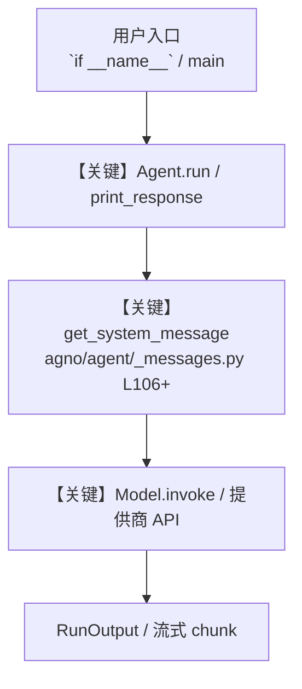

# 19_team.py — 实现原理分析

<!-- cookbook-py-source:start -->
## 完整源码

```python
"""
Multi-Agent Team - Writer, Editor, and Fact-Checker
=====================================================
Coordinate specialized agents with a team leader. Writer drafts, Editor refines, Fact-Checker verifies.

Key concepts:
- Team: Coordinates multiple agents, each with a specific role
- Team leader: An LLM (typically a stronger model) that delegates to members
- members: List of Agent instances the team can delegate to
- show_members_responses: If True, shows each member's response in the output
- role: A short description of what each member agent does (helps the leader delegate)

Example prompts to try:
- "Write a blog post about the health benefits of Mediterranean diet"
- "Create an article about the future of AI in healthcare"
- "Write a travel guide for visiting Tokyo in cherry blossom season"
"""

from agno.agent import Agent
from agno.models.google import Gemini
from agno.team.team import Team
from agno.tools.websearch import WebSearchTools
from db import gemini_agents_db

# ---------------------------------------------------------------------------
# Writer Agent: drafts content
# ---------------------------------------------------------------------------
writer_instructions = """\
You are a professional content writer. Write engaging, well-structured blog posts.

## Workflow

1. Research the topic using web search
2. Write a compelling draft with clear structure
3. Include an introduction, body sections, and conclusion

## Rules

- Use clear, accessible language
- Include relevant facts and statistics
- Structure with headers and bullet points where appropriate
- No emojis\
"""

writer = Agent(
    name="Writer",
    # role helps the team leader understand what this agent does
    role="Write engaging blog post drafts",
    model=Gemini(id="gemini-3-flash-preview"),
    instructions=writer_instructions,
    tools=[WebSearchTools()],
    db=gemini_agents_db,
    add_datetime_to_context=True,
)

# ---------------------------------------------------------------------------
# Editor Agent: reviews and improves (no tools, text-only)
# ---------------------------------------------------------------------------
editor_instructions = """\
You are a senior editor. Review content for quality and suggest improvements.

## Review Checklist

- Clarity: Is the message clear and easy to follow?
- Structure: Is the content well-organized?
- Grammar: Are there any grammatical errors?
- Tone: Is the tone consistent and appropriate?
- Engagement: Will readers find this interesting?

## Rules

- Be specific about what needs improvement
- Suggest concrete rewrites, not vague feedback
- Acknowledge what works well
- No emojis\
"""

editor = Agent(
    name="Editor",
    role="Review and improve content for clarity and quality",
    model=Gemini(id="gemini-3-flash-preview"),
    instructions=editor_instructions,
    db=gemini_agents_db,
    add_datetime_to_context=True,
)

# ---------------------------------------------------------------------------
# Fact-Checker Agent: verifies claims
# ---------------------------------------------------------------------------
fact_checker_instructions = """\
You are a fact-checker. Verify claims made in the content.

## Workflow

1. Identify all factual claims in the content
2. Search for evidence supporting or contradicting each claim
3. Flag any unverified or incorrect claims
4. Provide corrections with sources

## Rules

- Check every statistical claim and date
- Provide sources for corrections
- Rate confidence: Verified / Unverified / Incorrect
- No emojis\
"""

fact_checker_member = Agent(
    name="Fact Checker",
    role="Verify factual claims using web search",
    # Uses Gemini's native search for fact-checking
    model=Gemini(id="gemini-3-flash-preview", search=True),
    instructions=fact_checker_instructions,
    db=gemini_agents_db,
    add_datetime_to_context=True,
)

# ---------------------------------------------------------------------------
# Create Team
# ---------------------------------------------------------------------------
content_team = Team(
    name="Content Team",
    # Team leader uses a stronger model for better delegation decisions
    model=Gemini(id="gemini-3.1-pro-preview"),
    members=[writer, editor, fact_checker_member],
    instructions="""\
You lead a content creation team with a Writer, Editor, and Fact-Checker.

## Process

1. Send the topic to the Writer to create a draft
2. Send the draft to the Editor for review
3. If the Editor finds issues, send back to the Writer to revise
4. Send the final draft to the Fact-Checker to verify claims
5. Synthesize into a final, polished blog post

## Output Format

Provide the final blog post followed by:
- **Editorial Notes**: Key improvements made during editing
- **Fact-Check Summary**: Verification status of key claims\
""",
    db=gemini_agents_db,
    # Show each member's response in the output
    show_members_responses=True,
    add_datetime_to_context=True,
    markdown=True,
)

# ---------------------------------------------------------------------------
# Run Demo
# ---------------------------------------------------------------------------
if __name__ == "__main__":
    content_team.print_response(
        "Write a blog post about the health benefits of Mediterranean diet",
        stream=True,
    )

# ---------------------------------------------------------------------------
# More Examples
# ---------------------------------------------------------------------------
"""
Team patterns:

1. Research team (search + analysis)
   members=[researcher, analyst, summarizer]

2. Code review team (write + review + test)
   members=[coder, reviewer, tester]

3. Creative team (ideate + create + critique)
   members=[brainstormer, creator, critic]

When to use teams vs single agents:
- Single agent: Task is well-defined, one perspective is enough
- Team: Task benefits from multiple specialist perspectives
- Workflow (step 20): Steps must happen in a specific, predictable order

Use cases for music/film/gaming:
- Music: Lyricist + Composer + Producer agents
- Film: Scriptwriter + Director + Continuity Checker agents
- Gaming: Designer + Artist + QA Tester agents
"""
```

<!-- cookbook-py-source:end -->

> 源文件：`cookbook/gemini_3/19_team.py`

## 概述

Multi-Agent Team - Writer, Editor, and Fact-Checker

本示例归类：**Team 多智能体**；模型相关类型：`Gemini`。

**核心配置一览：**

| 配置项 | 值 | 说明 |
|--------|------|------|
| `name` | 'Writer' | `Agent(...)` |
| `role` | 'Write engaging blog post drafts' | `Agent(...)` |
| `model` | Gemini(id='gemini-3-flash-preview'…) | `Agent(...)` |
| `instructions` | 'You are a professional content writer. Write engaging, well-structured blog posts.\n\n## Workflow\n\n1. Research the topi...' | `Agent(...)` |
| `db` | 变量 `gemini_agents_db` | `Agent(...)` |
| `add_datetime_to_context` | True | `Agent(...)` |
| （Model 类） | `Gemini` | `agno.models` |

## 架构分层

```
用户 / cookbook 示例              Agno 框架
┌──────────────────────┐         ┌────────────────────────────────┐
│ 19_team.py           │  ──▶  │ Agent → get_run_messages → Model │
└──────────────────────┘         └────────────────────────────────┘
                                          │
                                          ▼
                                  ┌───────────────┐
                                  │ 对应 Model 子类 │
                                  └───────────────┘
```

## 核心组件解析

### 运行机制与因果链

1. **入口**：从模块 `__main__` 或暴露的 `agent` / `team` 调用进入；同步用 `print_response` / `run`，异步用 `aprint_response` / `arun`（若源码中有）。
2. **消息**：默认路径下 system 内容由 `get_system_message()`（`libs/agno/agno/agent/_messages.py` 约 **L106** 起）按分段逻辑拼装；若显式传入 `system_message` 则早退使用该字符串。
3. **模型**：具体 HTTP/SDK 形态以 `libs/agno/agno/models/` 下对应类的 `invoke` / `ainvoke` 为准（勿默认写成单一 `chat.completions`）。
4. **副作用**：若配置 `db`、`knowledge`、`memory`，运行会读写存储；仅以本文件为准对照。

### 与框架的衔接

- **System**：`get_system_message()` 锚点 `agno/agent/_messages.py` **L106+**。
- **运行**：`Agent.print_response` 等入口 `agno/agent/agent.py`（以当前仓库检索为准）。

## System Prompt 组装

| 序号 | 组成部分 | 本文件 | 是否生效 |
|------|---------|--------|---------|
| 1 | `instructions` / `description` 等 | 见核心配置表与源码 | 有赋值则生效 |
| 2 | 默认分段（markdown、时间等） | 取决于 `Agent` 默认与显式参数 | 视参数 |

### 拼装顺序与源码锚点

1. `system_message` 直给 → 使用该内容（见 `_messages.py` 文档字符串分支说明）。
2. 否则默认拼装：`description`、`role`、`instructions`、markdown 附加段等按 `# 3.x` 注释顺序合并。

### 还原后的完整 System 文本

```text
--- role ---
Write engaging blog post drafts

--- instructions ---
You are a professional content writer. Write engaging, well-structured blog posts.

## Workflow

1. Research the topic using web search
2. Write a compelling draft with clear structure
3. Include an introduction, body sections, and conclusion

## Rules

- Use clear, accessible language
- Include relevant facts and statistics
- Structure with headers and bullet points where appropriate
- No emojis
```

### 段落释义（模型视角）

- 指令与安全边界由 `instructions` / `system_message` 约束；若带 `tools` / `knowledge`，文档中需体现「何时检索/调用」由框架注入的提示段支持。

## 完整 API 请求

```python
# 请以本文件实际 Model 为准打开 libs/agno/agno/models/<厂商>/ 下对应类的 invoke：
# 可能是 chat.completions.create、responses.create、Gemini generate_content 等。
```

> 与上一节 system 文本在同一 run 中组合；`developer`/`system` 角色由适配器转换。



**【关键】节点说明：**

- **print_response / run**：用户可见的同步入口。
- **get_system_message**：系统提示拼装核心。
- **Model.invoke**：对模型提供商的实际请求。

## 关键源码文件索引

| 文件 | 作用 |
|------|------|
| `agno/agent/_messages.py` | `get_system_message()` L106+ |
| `agno/agent/agent.py` | `Agent` 运行与 CLI 输出 |
| `agno/models/` | 各厂商 `Model.invoke` |
