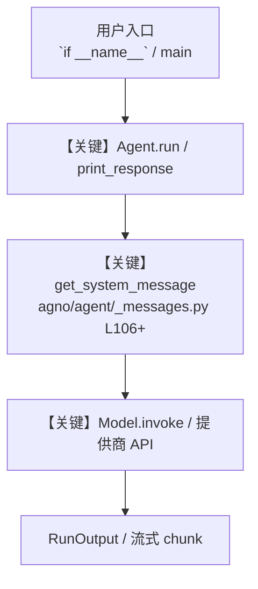

# 1_basic.py — 实现原理分析

<!-- cookbook-py-source:start -->
## 完整源码

```python
"""
Basic Agent - Your First Gemini Agent
=======================================
Simple Agno agent with Gemini 3 Flash.

Key concepts:
- Agent: The core building block in Agno wraps a model with instructions
- print_response: Runs the agent and prints formatted output
- stream=True: Streams tokens as they arrive instead of waiting for the full response
- Sync vs async: Every Agno method has an async variant (aprint_response, arun, etc.)

Example prompts to try:
- "What are the top 3 things to see in Paris?"
- "Explain quantum computing in simple terms"
- "Write a haiku about programming"
"""

import asyncio

from agno.agent import Agent
from agno.models.google import Gemini

# ---------------------------------------------------------------------------
# Create Agent
# ---------------------------------------------------------------------------
chat_agent = Agent(
    name="Chat Assistant",
    model=Gemini(id="gemini-3-flash-preview"),
    # markdown=True renders rich formatting in the terminal
    markdown=True,
)

# ---------------------------------------------------------------------------
# Run Agent
# ---------------------------------------------------------------------------
if __name__ == "__main__":
    # --- Sync ---
    # chat_agent.print_response("What are the top 3 things to see in Paris?")

    # --- Sync + Streaming ---
    # chat_agent.print_response(
    #     "What are the top 3 things to see in Paris?", stream=True
    # )

    # --- Async ---
    # asyncio.run(
    #     chat_agent.aprint_response("What are the top 3 things to see in Paris?")
    # )

    # --- Async + Streaming ---
    asyncio.run(
        chat_agent.aprint_response(
            "What are the top 3 things to see in Paris?", stream=True
        )
    )

# ---------------------------------------------------------------------------
# More Examples
# ---------------------------------------------------------------------------
"""
Agno supports four execution modes for every agent:

1. Sync (blocking)
   agent.print_response("prompt")
   response = agent.run("prompt")

2. Sync + Streaming (tokens arrive as they're generated)
   agent.print_response("prompt", stream=True)
   for chunk in agent.run("prompt", stream=True):
       print(chunk.content, end="")

3. Async (non-blocking)
   await agent.aprint_response("prompt")
   response = await agent.arun("prompt")

4. Async + Streaming
   await agent.aprint_response("prompt", stream=True)
   async for chunk in await agent.arun("prompt", stream=True):
       print(chunk.content, end="")

All examples in this guide use sync for simplicity.
For production apps, use async (see cookbook/02_agents/ for patterns).
"""
```

<!-- cookbook-py-source:end -->

> 源文件：`cookbook/gemini_3/1_basic.py`

## 概述

Basic Agent - Your First Gemini Agent

本示例归类：**单 Agent**；模型相关类型：`Gemini`。

**核心配置一览：**

| 配置项 | 值 | 说明 |
|--------|------|------|
| `name` | 'Chat Assistant' | `Agent(...)` |
| `model` | Gemini(id='gemini-3-flash-preview'…) | `Agent(...)` |
| `markdown` | True | `Agent(...)` |
| （Model 类） | `Gemini` | `agno.models` |

## 架构分层

```
用户 / cookbook 示例              Agno 框架
┌──────────────────────┐         ┌────────────────────────────────┐
│ 1_basic.py           │  ──▶  │ Agent → get_run_messages → Model │
└──────────────────────┘         └────────────────────────────────┘
                                          │
                                          ▼
                                  ┌───────────────┐
                                  │ 对应 Model 子类 │
                                  └───────────────┘
```

## 核心组件解析

### 运行机制与因果链

1. **入口**：从模块 `__main__` 或暴露的 `agent` / `team` 调用进入；同步用 `print_response` / `run`，异步用 `aprint_response` / `arun`（若源码中有）。
2. **消息**：默认路径下 system 内容由 `get_system_message()`（`libs/agno/agno/agent/_messages.py` 约 **L106** 起）按分段逻辑拼装；若显式传入 `system_message` 则早退使用该字符串。
3. **模型**：具体 HTTP/SDK 形态以 `libs/agno/agno/models/` 下对应类的 `invoke` / `ainvoke` 为准（勿默认写成单一 `chat.completions`）。
4. **副作用**：若配置 `db`、`knowledge`、`memory`，运行会读写存储；仅以本文件为准对照。

### 与框架的衔接

- **System**：`get_system_message()` 锚点 `agno/agent/_messages.py` **L106+**。
- **运行**：`Agent.print_response` 等入口 `agno/agent/agent.py`（以当前仓库检索为准）。

## System Prompt 组装

| 序号 | 组成部分 | 本文件 | 是否生效 |
|------|---------|--------|---------|
| 1 | `instructions` / `description` 等 | 见核心配置表与源码 | 有赋值则生效 |
| 2 | 默认分段（markdown、时间等） | 取决于 `Agent` 默认与显式参数 | 视参数 |

### 拼装顺序与源码锚点

1. `system_message` 直给 → 使用该内容（见 `_messages.py` 文档字符串分支说明）。
2. 否则默认拼装：`description`、`role`、`instructions`、markdown 附加段等按 `# 3.x` 注释顺序合并。

### 还原后的完整 System 文本

```text
（主 `Agent(...)` 未传入可静态解析的 `description`/`instructions`/`system_message` 字符串；此时 system 由 `get_system_message()` 默认段与 `markdown` 等开关决定，请在 `agno/agent/_messages.py` 对照分段注释，或在运行中打印 `get_system_message` 返回值。）
```

### 段落释义（模型视角）

- 指令与安全边界由 `instructions` / `system_message` 约束；若带 `tools` / `knowledge`，文档中需体现「何时检索/调用」由框架注入的提示段支持。

## 完整 API 请求

```python
# 请以本文件实际 Model 为准打开 libs/agno/agno/models/<厂商>/ 下对应类的 invoke：
# 可能是 chat.completions.create、responses.create、Gemini generate_content 等。
```

> 与上一节 system 文本在同一 run 中组合；`developer`/`system` 角色由适配器转换。



**【关键】节点说明：**

- **print_response / run**：用户可见的同步入口。
- **get_system_message**：系统提示拼装核心。
- **Model.invoke**：对模型提供商的实际请求。

## 关键源码文件索引

| 文件 | 作用 |
|------|------|
| `agno/agent/_messages.py` | `get_system_message()` L106+ |
| `agno/agent/agent.py` | `Agent` 运行与 CLI 输出 |
| `agno/models/` | 各厂商 `Model.invoke` |
