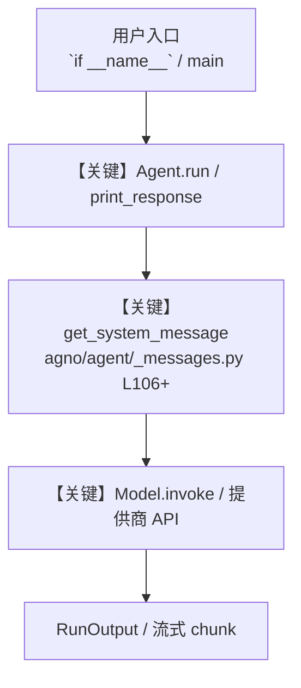

# 20_workflow.py — 实现原理分析

<!-- cookbook-py-source:start -->
## 完整源码

```python
"""
Workflow - Step-Based Agentic Pipeline
========================================
Build a multi-step pipeline where steps execute in a defined order.

Key concepts:
- Workflow: Orchestrates steps in sequence, with branching and parallelism
- Step: A single unit of work, backed by an Agent, Team, or custom function
- Parallel: Run multiple steps concurrently
- Condition: Branch based on previous step output
- StepInput: Carries the original input + all previous step outputs
- StepOutput: What a step returns (content, stop flag, success flag)
- session_state: Persistent state across steps (saved to db)

Example prompts to try:
- "Latest developments in AI agents and autonomous systems"
- "The impact of climate change on global food production"
- "History and future of space exploration"
"""

from agno.agent import Agent
from agno.models.google import Gemini
from agno.tools.websearch import WebSearchTools
from agno.workflow import (
    Condition,
    Parallel,
    Step,
    StepInput,
    StepOutput,
    Workflow,
)
from db import gemini_agents_db

# ---------------------------------------------------------------------------
# Agents: each handles one stage of the pipeline
# ---------------------------------------------------------------------------
web_researcher = Agent(
    name="Web Researcher",
    model=Gemini(id="gemini-3-flash-preview", search=True),
    instructions="""\
You are a web researcher. Search for the latest information on the given topic.

## Rules

- Find recent, credible sources
- Include key facts, statistics, and expert opinions
- Cite your sources
- No emojis\
""",
    add_datetime_to_context=True,
)

deep_researcher = Agent(
    name="Deep Researcher",
    model=Gemini(id="gemini-3-flash-preview"),
    tools=[WebSearchTools()],
    instructions="""\
You are a deep researcher. Search extensively for background context,
historical data, and expert analysis on the given topic.

## Rules

- Go beyond surface-level information
- Find contrasting viewpoints
- Include historical context and trends
- No emojis\
""",
    add_datetime_to_context=True,
)

analyst = Agent(
    name="Analyst",
    model=Gemini(id="gemini-3.1-pro-preview"),
    instructions="""\
You are a senior analyst. Synthesize research from multiple sources
into a clear, structured analysis.

## Rules

- Identify key themes and patterns across sources
- Highlight areas of agreement and disagreement
- Draw evidence-based conclusions
- Structure with clear sections and headers
- No emojis\
""",
)

report_writer = Agent(
    name="Report Writer",
    model=Gemini(id="gemini-3.1-pro-preview"),
    instructions="""\
You are a report writer. Transform analysis into a polished,
publication-ready report.

## Rules

- Write a compelling introduction that hooks the reader
- Use clear, accessible language
- Include an executive summary at the top
- End with key takeaways and future outlook
- No emojis\
""",
)

fact_checker = Agent(
    name="Fact Checker",
    model=Gemini(id="gemini-3-flash-preview", search=True),
    instructions="""\
You are a fact-checker. Verify the factual claims in the report.

## Rules

- Check every statistic, date, and named claim
- Search for primary sources
- Flag anything unverified as [UNVERIFIED]
- Provide the corrected report with a verification summary at the end
- No emojis\
""",
)


# ---------------------------------------------------------------------------
# Custom step functions
# ---------------------------------------------------------------------------
def quality_gate(step_input: StepInput) -> StepOutput:
    """Check that the analysis has enough substance to proceed."""
    content = str(step_input.previous_step_content or "")
    if len(content) < 200:
        return StepOutput(
            content="Quality gate failed: analysis too short. Stopping pipeline.",
            stop=True,
            success=False,
        )
    return StepOutput(
        content=content,
        success=True,
    )


def needs_fact_check(step_input: StepInput) -> bool:
    """Decide whether the report needs fact-checking."""
    content = str(step_input.previous_step_content or "").lower()
    indicators = [
        "study",
        "research",
        "percent",
        "%",
        "million",
        "billion",
        "according",
    ]
    return any(indicator in content for indicator in indicators)


# ---------------------------------------------------------------------------
# Build Workflow
# ---------------------------------------------------------------------------
research_pipeline = Workflow(
    id="gemini-research-pipeline",
    name="Research Pipeline",
    description="Research-to-publication pipeline: parallel research, analysis, quality gate, writing, and conditional fact-checking.",
    db=gemini_agents_db,
    steps=[
        # Step 1: Research in parallel (two agents search simultaneously)
        Parallel(
            "Research",
            Step(name="web_research", agent=web_researcher),
            Step(name="deep_research", agent=deep_researcher),
        ),
        # Step 2: Analyst synthesizes all research
        Step(name="analysis", agent=analyst),
        # Step 3: Quality gate (stop early if analysis is too thin)
        Step(name="quality_gate", executor=quality_gate),
        # Step 4: Writer produces the final report
        Step(name="report", agent=report_writer),
        # Step 5: Conditionally fact-check (only if the report has factual claims)
        Condition(
            name="fact_check_gate",
            evaluator=needs_fact_check,
            steps=[Step(name="fact_check", agent=fact_checker)],
        ),
    ],
)

# ---------------------------------------------------------------------------
# Run Workflow
# ---------------------------------------------------------------------------
if __name__ == "__main__":
    research_pipeline.print_response(
        "Latest developments in AI agents and autonomous systems",
        stream=True,
    )

# ---------------------------------------------------------------------------
# More Examples
# ---------------------------------------------------------------------------
"""
Workflow vs Team:

- Team (step 19): Leader LLM decides who to delegate to at runtime.
  Flexible but less predictable. Best for creative, open-ended tasks.

- Workflow (this step): Steps execute in a defined order with explicit
  branching logic. Predictable and repeatable. Best for pipelines.

Workflow building blocks:

1. Step(agent=...)            Run an agent
2. Step(team=...)             Run a team
3. Step(executor=fn)          Run a custom function
4. Parallel(step1, step2)     Run steps concurrently
5. Condition(evaluator, ...)  Branch based on logic
6. Loop(steps, ...)           Repeat until done
7. Router(choices, selector)  Dynamically pick which step to run

Accessing previous step outputs in a custom executor:

    def my_step(step_input: StepInput) -> StepOutput:
        # Original workflow input
        original = step_input.input

        # Output from the immediately preceding step
        last = step_input.previous_step_content

        # Output from a specific named step
        research = step_input.get_step_content("web_research")

        # All previous outputs concatenated
        everything = step_input.get_all_previous_content()

        return StepOutput(content="done")

Early stopping from any step:

    return StepOutput(content="Stopping.", stop=True)
"""
```

<!-- cookbook-py-source:end -->

> 源文件：`cookbook/gemini_3/20_workflow.py`

## 概述

Workflow - Step-Based Agentic Pipeline

本示例归类：**Team 多智能体**；模型相关类型：`Gemini`。

**核心配置一览：**

| 配置项 | 值 | 说明 |
|--------|------|------|
| `name` | 'Web Researcher' | `Agent(...)` |
| `model` | Gemini(id='gemini-3-flash-preview'search=True…) | `Agent(...)` |
| `instructions` | 'You are a web researcher. Search for the latest information on the given topic.\n\n## Rules\n\n- Find recent, credible sources\n- Include key facts, statistics, and expert opinions\n- Cite your sources\n-...' | `Agent(...)` |
| `add_datetime_to_context` | True | `Agent(...)` |
| （Model 类） | `Gemini` | `agno.models` |

## 架构分层

```
用户 / cookbook 示例              Agno 框架
┌──────────────────────┐         ┌────────────────────────────────┐
│ 20_workflow.py       │  ──▶  │ Agent → get_run_messages → Model │
└──────────────────────┘         └────────────────────────────────┘
                                          │
                                          ▼
                                  ┌───────────────┐
                                  │ 对应 Model 子类 │
                                  └───────────────┘
```

## 核心组件解析

### 运行机制与因果链

1. **入口**：从模块 `__main__` 或暴露的 `agent` / `team` 调用进入；同步用 `print_response` / `run`，异步用 `aprint_response` / `arun`（若源码中有）。
2. **消息**：默认路径下 system 内容由 `get_system_message()`（`libs/agno/agno/agent/_messages.py` 约 **L106** 起）按分段逻辑拼装；若显式传入 `system_message` 则早退使用该字符串。
3. **模型**：具体 HTTP/SDK 形态以 `libs/agno/agno/models/` 下对应类的 `invoke` / `ainvoke` 为准（勿默认写成单一 `chat.completions`）。
4. **副作用**：若配置 `db`、`knowledge`、`memory`，运行会读写存储；仅以本文件为准对照。

### 与框架的衔接

- **System**：`get_system_message()` 锚点 `agno/agent/_messages.py` **L106+**。
- **运行**：`Agent.print_response` 等入口 `agno/agent/agent.py`（以当前仓库检索为准）。

## System Prompt 组装

| 序号 | 组成部分 | 本文件 | 是否生效 |
|------|---------|--------|---------|
| 1 | `instructions` / `description` 等 | 见核心配置表与源码 | 有赋值则生效 |
| 2 | 默认分段（markdown、时间等） | 取决于 `Agent` 默认与显式参数 | 视参数 |

### 拼装顺序与源码锚点

1. `system_message` 直给 → 使用该内容（见 `_messages.py` 文档字符串分支说明）。
2. 否则默认拼装：`description`、`role`、`instructions`、markdown 附加段等按 `# 3.x` 注释顺序合并。

### 还原后的完整 System 文本

```text
--- instructions ---
You are a web researcher. Search for the latest information on the given topic.

## Rules

- Find recent, credible sources
- Include key facts, statistics, and expert opinions
- Cite your sources
- No emojis
```

### 段落释义（模型视角）

- 指令与安全边界由 `instructions` / `system_message` 约束；若带 `tools` / `knowledge`，文档中需体现「何时检索/调用」由框架注入的提示段支持。

## 完整 API 请求

```python
# 请以本文件实际 Model 为准打开 libs/agno/agno/models/<厂商>/ 下对应类的 invoke：
# 可能是 chat.completions.create、responses.create、Gemini generate_content 等。
```

> 与上一节 system 文本在同一 run 中组合；`developer`/`system` 角色由适配器转换。



**【关键】节点说明：**

- **print_response / run**：用户可见的同步入口。
- **get_system_message**：系统提示拼装核心。
- **Model.invoke**：对模型提供商的实际请求。

## 关键源码文件索引

| 文件 | 作用 |
|------|------|
| `agno/agent/_messages.py` | `get_system_message()` L106+ |
| `agno/agent/agent.py` | `Agent` 运行与 CLI 输出 |
| `agno/models/` | 各厂商 `Model.invoke` |
