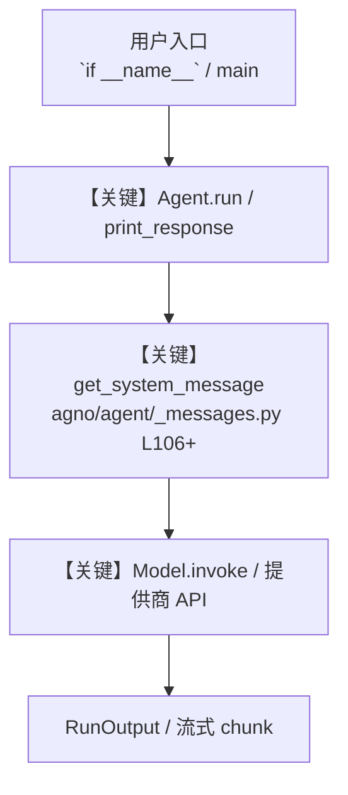

# 6_url_context.py — 实现原理分析

<!-- cookbook-py-source:start -->
## 完整源码

```python
"""
URL Context - Read and Compare Web Pages
==========================================
Fetch and read web pages natively. Just set url_context=True on the model.

Key concepts:
- url_context=True: Enables Gemini to fetch and read URLs from the prompt
- Native capability: The model handles HTTP requests internally
- No extra tools: Unlike web scraping, this needs no additional packages
- Best with Pro: URL context works better with Gemini Pro models

Example prompts to try:
- "Compare the recipes at these two URLs"
- "Summarize the key points from this article: <URL>"
- "What are the differences between these two product pages?"
"""

from agno.agent import Agent
from agno.models.google import Gemini

# ---------------------------------------------------------------------------
# Agent Instructions
# ---------------------------------------------------------------------------
instructions = """\
You are a comparison expert. Analyze content from URLs and provide
clear, structured comparisons.

## Rules

- Read all provided URLs thoroughly
- Use tables for side-by-side comparisons
- Highlight key differences and similarities
- Be specific, cite details from each source
"""

# ---------------------------------------------------------------------------
# Create Agent
# ---------------------------------------------------------------------------
url_agent = Agent(
    name="URL Context Agent",
    # url_context=True lets Gemini fetch and read URLs from the prompt
    model=Gemini(id="gemini-3.1-pro-preview", url_context=True),
    instructions=instructions,
    markdown=True,
)

# ---------------------------------------------------------------------------
# Run Agent
# ---------------------------------------------------------------------------
if __name__ == "__main__":
    url1 = "https://www.foodnetwork.com/recipes/ina-garten/perfect-roast-chicken-recipe-1940592"
    url2 = "https://www.allrecipes.com/recipe/83557/juicy-roasted-chicken/"

    url_agent.print_response(
        f"Compare the ingredients and cooking times from the recipes at {url1} and {url2}",
        stream=True,
    )

# ---------------------------------------------------------------------------
# More Examples
# ---------------------------------------------------------------------------
"""
URL context use cases:

1. Compare two articles
   "Compare the arguments in <url1> vs <url2>"

2. Summarize a long page
   "Summarize the key takeaways from <url>"

3. Extract structured data from a page
   agent = Agent(model=Gemini(id="...", url_context=True), output_schema=MySchema)
   result = agent.run("Extract product details from <url>")

4. Research across multiple sources
   "What do these 3 articles say about <topic>? <url1> <url2> <url3>"

Note: URL context reads the page content at request time. The model
does not cache pages between requests.
"""
```

<!-- cookbook-py-source:end -->

> 源文件：`cookbook/gemini_3/6_url_context.py`

## 概述

URL Context - Read and Compare Web Pages

本示例归类：**单 Agent**；模型相关类型：`Gemini`。

**核心配置一览：**

| 配置项 | 值 | 说明 |
|--------|------|------|
| `name` | 'URL Context Agent' | `Agent(...)` |
| `model` | Gemini(id='gemini-3.1-pro-preview'url_context=True…) | `Agent(...)` |
| `instructions` | 'You are a comparison expert. Analyze content from URLs and provide\nclear, structured comparisons.\n\n## Rules\n\n- Read a...' | `Agent(...)` |
| `markdown` | True | `Agent(...)` |
| （Model 类） | `Gemini` | `agno.models` |

## 架构分层

```
用户 / cookbook 示例              Agno 框架
┌──────────────────────┐         ┌────────────────────────────────┐
│ 6_url_context.py     │  ──▶  │ Agent → get_run_messages → Model │
└──────────────────────┘         └────────────────────────────────┘
                                          │
                                          ▼
                                  ┌───────────────┐
                                  │ 对应 Model 子类 │
                                  └───────────────┘
```

## 核心组件解析

### 运行机制与因果链

1. **入口**：从模块 `__main__` 或暴露的 `agent` / `team` 调用进入；同步用 `print_response` / `run`，异步用 `aprint_response` / `arun`（若源码中有）。
2. **消息**：默认路径下 system 内容由 `get_system_message()`（`libs/agno/agno/agent/_messages.py` 约 **L106** 起）按分段逻辑拼装；若显式传入 `system_message` 则早退使用该字符串。
3. **模型**：具体 HTTP/SDK 形态以 `libs/agno/agno/models/` 下对应类的 `invoke` / `ainvoke` 为准（勿默认写成单一 `chat.completions`）。
4. **副作用**：若配置 `db`、`knowledge`、`memory`，运行会读写存储；仅以本文件为准对照。

### 与框架的衔接

- **System**：`get_system_message()` 锚点 `agno/agent/_messages.py` **L106+**。
- **运行**：`Agent.print_response` 等入口 `agno/agent/agent.py`（以当前仓库检索为准）。

## System Prompt 组装

| 序号 | 组成部分 | 本文件 | 是否生效 |
|------|---------|--------|---------|
| 1 | `instructions` / `description` 等 | 见核心配置表与源码 | 有赋值则生效 |
| 2 | 默认分段（markdown、时间等） | 取决于 `Agent` 默认与显式参数 | 视参数 |

### 拼装顺序与源码锚点

1. `system_message` 直给 → 使用该内容（见 `_messages.py` 文档字符串分支说明）。
2. 否则默认拼装：`description`、`role`、`instructions`、markdown 附加段等按 `# 3.x` 注释顺序合并。

### 还原后的完整 System 文本

```text
--- instructions ---
You are a comparison expert. Analyze content from URLs and provide
clear, structured comparisons.

## Rules

- Read all provided URLs thoroughly
- Use tables for side-by-side comparisons
- Highlight key differences and similarities
- Be specific, cite details from each source
```

### 段落释义（模型视角）

- 指令与安全边界由 `instructions` / `system_message` 约束；若带 `tools` / `knowledge`，文档中需体现「何时检索/调用」由框架注入的提示段支持。

## 完整 API 请求

```python
# 请以本文件实际 Model 为准打开 libs/agno/agno/models/<厂商>/ 下对应类的 invoke：
# 可能是 chat.completions.create、responses.create、Gemini generate_content 等。
```

> 与上一节 system 文本在同一 run 中组合；`developer`/`system` 角色由适配器转换。



**【关键】节点说明：**

- **print_response / run**：用户可见的同步入口。
- **get_system_message**：系统提示拼装核心。
- **Model.invoke**：对模型提供商的实际请求。

## 关键源码文件索引

| 文件 | 作用 |
|------|------|
| `agno/agent/_messages.py` | `get_system_message()` L106+ |
| `agno/agent/agent.py` | `Agent` 运行与 CLI 输出 |
| `agno/models/` | 各厂商 `Model.invoke` |
