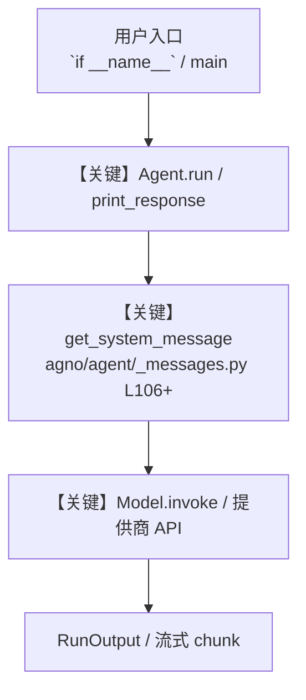

# 9_image_generation.py — 实现原理分析

<!-- cookbook-py-source:start -->
## 完整源码

```python
"""
Image Generation and Editing - Create and Modify Images
=========================================================
Generate and edit images natively with Gemini. No external tools needed.

Key concepts:
- response_modalities=["Text", "Image"]: Tells Gemini to output both text and images
- RunOutput.images: Access generated images from the response
- Image editing: Pass an existing image + instructions to modify it
- No system message: Image generation does not support system instructions

Example prompts to try:
- "Make me an image of a cat sitting in a tree"
- "Create a minimalist logo for a coffee shop called 'Bean Scene'"
- "Generate a fantasy landscape with mountains and a castle"
"""

from io import BytesIO
from pathlib import Path

from agno.agent import Agent, RunOutput
from agno.media import Image
from agno.models.google import Gemini

WORKSPACE = Path(__file__).parent.joinpath("workspace")
WORKSPACE.mkdir(parents=True, exist_ok=True)

# ---------------------------------------------------------------------------
# Create Agent (no system message, required for image generation)
# ---------------------------------------------------------------------------
image_gen_agent = Agent(
    name="Image Generator",
    model=Gemini(
        id="gemini-3.1-flash-image-preview",
        # Enable both text and image output
        response_modalities=["Text", "Image"],
    ),
)

# ---------------------------------------------------------------------------
# Run Agent
# ---------------------------------------------------------------------------
if __name__ == "__main__":
    try:
        from PIL import Image as PILImage
    except ImportError:
        raise ImportError("Install Pillow to run this example: pip install Pillow")

    # --- Generate an image ---
    print("Generating an image...")
    run_response = image_gen_agent.run("Make me an image of a cat sitting in a tree.")

    if run_response and isinstance(run_response, RunOutput) and run_response.images:
        for i, image_response in enumerate(run_response.images):
            image_bytes = image_response.content
            if image_bytes:
                image = PILImage.open(BytesIO(image_bytes))
                output_path = WORKSPACE / f"generated_{i}.png"
                image.save(str(output_path))
                print(f"Saved generated image to {output_path}")
    else:
        print("No images found in response")

    # --- Edit an existing image ---
    print("\nEditing the generated image...")
    generated_path = WORKSPACE / "generated_0.png"
    if generated_path.exists():
        edit_response = image_gen_agent.run(
            "Add a rainbow in the sky of this image.",
            images=[Image(filepath=str(generated_path))],
        )

        if (
            edit_response
            and isinstance(edit_response, RunOutput)
            and edit_response.images
        ):
            for i, image_response in enumerate(edit_response.images):
                image_bytes = image_response.content
                if image_bytes:
                    image = PILImage.open(BytesIO(image_bytes))
                    output_path = WORKSPACE / f"edited_{i}.png"
                    image.save(str(output_path))
                    print(f"Saved edited image to {output_path}")
        else:
            print("No edited images found in response")

# ---------------------------------------------------------------------------
# More Examples
# ---------------------------------------------------------------------------
"""
Image generation tips:

1. Be specific in prompts
   "A watercolor painting of a sunset over the ocean with warm orange tones"
   is better than "sunset painting"

2. Image editing workflow
   # Generate
   result = agent.run("Create a logo for a tech startup")
   # Edit
   result = agent.run("Make the colors more vibrant", images=[...])
   # Iterate
   result = agent.run("Add the text 'ACME' below the logo", images=[...])

3. No system message allowed
   Image generation models don't support instructions=... on the agent.
   Put guidance directly in the prompt instead.

Use cases for music/film/gaming:
- Generate album cover concepts from descriptions
- Create character concept art for games
- Produce storyboard frames from scene descriptions
- Design promotional materials and posters
"""
```

<!-- cookbook-py-source:end -->

> 源文件：`cookbook/gemini_3/9_image_generation.py`

## 概述

Image Generation and Editing - Create and Modify Images

本示例归类：**单 Agent**；模型相关类型：`Gemini`。

**核心配置一览：**

| 配置项 | 值 | 说明 |
|--------|------|------|
| `name` | 'Image Generator' | `Agent(...)` |
| `model` | Gemini(id='gemini-3.1-flash-image-preview'…) | `Agent(...)` |
| （Model 类） | `Gemini` | `agno.models` |

## 架构分层

```
用户 / cookbook 示例              Agno 框架
┌──────────────────────┐         ┌────────────────────────────────┐
│ 9_image_generation.py │  ──▶  │ Agent → get_run_messages → Model │
└──────────────────────┘         └────────────────────────────────┘
                                          │
                                          ▼
                                  ┌───────────────┐
                                  │ 对应 Model 子类 │
                                  └───────────────┘
```

## 核心组件解析

### 运行机制与因果链

1. **入口**：从模块 `__main__` 或暴露的 `agent` / `team` 调用进入；同步用 `print_response` / `run`，异步用 `aprint_response` / `arun`（若源码中有）。
2. **消息**：默认路径下 system 内容由 `get_system_message()`（`libs/agno/agno/agent/_messages.py` 约 **L106** 起）按分段逻辑拼装；若显式传入 `system_message` 则早退使用该字符串。
3. **模型**：具体 HTTP/SDK 形态以 `libs/agno/agno/models/` 下对应类的 `invoke` / `ainvoke` 为准（勿默认写成单一 `chat.completions`）。
4. **副作用**：若配置 `db`、`knowledge`、`memory`，运行会读写存储；仅以本文件为准对照。

### 与框架的衔接

- **System**：`get_system_message()` 锚点 `agno/agent/_messages.py` **L106+**。
- **运行**：`Agent.print_response` 等入口 `agno/agent/agent.py`（以当前仓库检索为准）。

## System Prompt 组装

| 序号 | 组成部分 | 本文件 | 是否生效 |
|------|---------|--------|---------|
| 1 | `instructions` / `description` 等 | 见核心配置表与源码 | 有赋值则生效 |
| 2 | 默认分段（markdown、时间等） | 取决于 `Agent` 默认与显式参数 | 视参数 |

### 拼装顺序与源码锚点

1. `system_message` 直给 → 使用该内容（见 `_messages.py` 文档字符串分支说明）。
2. 否则默认拼装：`description`、`role`、`instructions`、markdown 附加段等按 `# 3.x` 注释顺序合并。

### 还原后的完整 System 文本

```text
（主 `Agent(...)` 未传入可静态解析的 `description`/`instructions`/`system_message` 字符串；此时 system 由 `get_system_message()` 默认段与 `markdown` 等开关决定，请在 `agno/agent/_messages.py` 对照分段注释，或在运行中打印 `get_system_message` 返回值。）
```

### 段落释义（模型视角）

- 指令与安全边界由 `instructions` / `system_message` 约束；若带 `tools` / `knowledge`，文档中需体现「何时检索/调用」由框架注入的提示段支持。

## 完整 API 请求

```python
# 请以本文件实际 Model 为准打开 libs/agno/agno/models/<厂商>/ 下对应类的 invoke：
# 可能是 chat.completions.create、responses.create、Gemini generate_content 等。
```

> 与上一节 system 文本在同一 run 中组合；`developer`/`system` 角色由适配器转换。



**【关键】节点说明：**

- **print_response / run**：用户可见的同步入口。
- **get_system_message**：系统提示拼装核心。
- **Model.invoke**：对模型提供商的实际请求。

## 关键源码文件索引

| 文件 | 作用 |
|------|------|
| `agno/agent/_messages.py` | `get_system_message()` L106+ |
| `agno/agent/agent.py` | `Agent` 运行与 CLI 输出 |
| `agno/models/` | 各厂商 `Model.invoke` |
