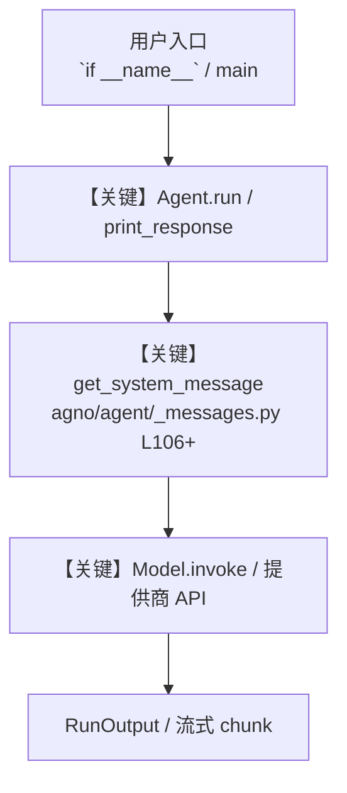

# film_scene_breakdown.py — 实现原理分析

<!-- cookbook-py-source:start -->
## 完整源码

```python
"""
Film Scene Breakdown - Analyze a Clip and Script with a Team
==============================================================
Combines video analysis, PDF reading, and a multi-agent team for film production.

Steps used: 12 (Video), 13 (PDF), 19 (Team)

Run:
    python cookbook/gemini_3/use_cases/film_scene_breakdown.py
"""

import httpx
from agno.agent import Agent
from agno.media import File, Video
from agno.models.google import Gemini
from agno.team.team import Team

# ---------------------------------------------------------------------------
# Video Analyst: watches and describes the clip
# ---------------------------------------------------------------------------
video_analyst = Agent(
    name="Video Analyst",
    role="Analyze video clips for visual content, pacing, and mood",
    model=Gemini(id="gemini-3-flash-preview"),
    instructions="""\
You are a film analysis expert. Watch video clips and provide detailed breakdowns.

## Describe

- Shot types (wide, close-up, tracking, etc.)
- Scene transitions and pacing
- Lighting, color grading, and visual mood
- Character actions and expressions
- Any text, titles, or graphics on screen

## Rules

- Use professional film terminology
- Describe chronologically
- Note timestamps for key moments
- No emojis\
""",
    markdown=True,
)

# ---------------------------------------------------------------------------
# Script Reader: extracts relevant content from the script PDF
# ---------------------------------------------------------------------------
script_reader = Agent(
    name="Script Reader",
    role="Read film scripts and extract relevant dialogue and directions",
    model=Gemini(id="gemini-3-flash-preview"),
    instructions="""\
You are a script supervisor. Read scripts and extract relevant information.

## Extract

- Scene headings (INT/EXT, location, time of day)
- Character dialogue
- Stage directions and action lines
- Camera directions if specified

## Rules

- Maintain script formatting conventions
- Note page numbers for reference
- Flag any ambiguous directions
- No emojis\
""",
    markdown=True,
)

# ---------------------------------------------------------------------------
# Continuity Editor: checks consistency
# ---------------------------------------------------------------------------
continuity_editor = Agent(
    name="Continuity Editor",
    role="Check consistency between script and footage",
    model=Gemini(id="gemini-3-flash-preview"),
    instructions="""\
You are a continuity editor. Compare the script to the footage and flag issues.

## Check

- Does the footage match the script's described action?
- Are dialogue lines delivered as written?
- Are props, costumes, and set dressing consistent?
- Does the lighting match the script's time-of-day?

## Rules

- Be specific about discrepancies
- Rate severity: Minor / Notable / Critical
- Suggest solutions for any issues found
- No emojis\
""",
    markdown=True,
)

# ---------------------------------------------------------------------------
# Team
# ---------------------------------------------------------------------------
production_team = Team(
    name="Production Team",
    model=Gemini(id="gemini-3.1-pro-preview"),
    members=[video_analyst, script_reader, continuity_editor],
    instructions="""\
You lead a film production team with a Video Analyst, Script Reader,
and Continuity Editor.

## Process

1. Send the video clip to the Video Analyst for visual breakdown
2. Send the script PDF to the Script Reader for dialogue and direction extraction
3. Send both analyses to the Continuity Editor for consistency check
4. Synthesize into a final scene breakdown

## Output Format

Provide a scene breakdown with:
- **Visual Summary**: Key shots and visual elements
- **Script Notes**: Relevant dialogue and directions
- **Continuity Report**: Any discrepancies found
- **Production Notes**: Recommendations for the edit\
""",
    show_members_responses=True,
    markdown=True,
)

# ---------------------------------------------------------------------------
# Run
# ---------------------------------------------------------------------------
if __name__ == "__main__":
    # Sample: analyze a video clip against a script PDF
    # Replace these with your own video and script URLs
    video_url = "https://agno-public.s3.amazonaws.com/demo/sample_seaview.mp4"
    script_url = "https://agno-public.s3.amazonaws.com/recipes/ThaiRecipes.pdf"

    print("Downloading video sample...")
    video_response = httpx.get(video_url)

    print("Running production team analysis...\n")
    production_team.print_response(
        "Analyze this video clip and compare it against the provided document. "
        "Produce a scene breakdown with visual analysis, script notes, "
        "and a continuity report.",
        videos=[Video(content=video_response.content, format="mp4")],
        files=[File(url=script_url)],
        stream=True,
    )
```

<!-- cookbook-py-source:end -->

> 源文件：`cookbook/gemini_3/use_cases/film_scene_breakdown.py`

## 概述

Film Scene Breakdown - Analyze a Clip and Script with a Team

本示例归类：**Team 多智能体**；模型相关类型：`Gemini`。

**核心配置一览：**

| 配置项 | 值 | 说明 |
|--------|------|------|
| `name` | 'Video Analyst' | `Agent(...)` |
| `role` | 'Analyze video clips for visual content, pacing, and mood' | `Agent(...)` |
| `model` | Gemini(id='gemini-3-flash-preview'…) | `Agent(...)` |
| `instructions` | 'You are a film analysis expert. Watch video clips and provide detailed breakdowns.\n\n## Describe\n\n- Shot types (wide, close-up, tracking, etc.)\n- Scene transitions and pacing\n- Lighting, color gradi...' | `Agent(...)` |
| `markdown` | True | `Agent(...)` |
| （Model 类） | `Gemini` | `agno.models` |

## 架构分层

```
用户 / cookbook 示例              Agno 框架
┌──────────────────────┐         ┌────────────────────────────────┐
│ film_scene_breakdown.py │  ──▶  │ Agent → get_run_messages → Model │
└──────────────────────┘         └────────────────────────────────┘
                                          │
                                          ▼
                                  ┌───────────────┐
                                  │ 对应 Model 子类 │
                                  └───────────────┘
```

## 核心组件解析

### 运行机制与因果链

1. **入口**：从模块 `__main__` 或暴露的 `agent` / `team` 调用进入；同步用 `print_response` / `run`，异步用 `aprint_response` / `arun`（若源码中有）。
2. **消息**：默认路径下 system 内容由 `get_system_message()`（`libs/agno/agno/agent/_messages.py` 约 **L106** 起）按分段逻辑拼装；若显式传入 `system_message` 则早退使用该字符串。
3. **模型**：具体 HTTP/SDK 形态以 `libs/agno/agno/models/` 下对应类的 `invoke` / `ainvoke` 为准（勿默认写成单一 `chat.completions`）。
4. **副作用**：若配置 `db`、`knowledge`、`memory`，运行会读写存储；仅以本文件为准对照。

### 与框架的衔接

- **System**：`get_system_message()` 锚点 `agno/agent/_messages.py` **L106+**。
- **运行**：`Agent.print_response` 等入口 `agno/agent/agent.py`（以当前仓库检索为准）。

## System Prompt 组装

| 序号 | 组成部分 | 本文件 | 是否生效 |
|------|---------|--------|---------|
| 1 | `instructions` / `description` 等 | 见核心配置表与源码 | 有赋值则生效 |
| 2 | 默认分段（markdown、时间等） | 取决于 `Agent` 默认与显式参数 | 视参数 |

### 拼装顺序与源码锚点

1. `system_message` 直给 → 使用该内容（见 `_messages.py` 文档字符串分支说明）。
2. 否则默认拼装：`description`、`role`、`instructions`、markdown 附加段等按 `# 3.x` 注释顺序合并。

### 还原后的完整 System 文本

```text
--- role ---
Analyze video clips for visual content, pacing, and mood

--- instructions ---
You are a film analysis expert. Watch video clips and provide detailed breakdowns.

## Describe

- Shot types (wide, close-up, tracking, etc.)
- Scene transitions and pacing
- Lighting, color grading, and visual mood
- Character actions and expressions
- Any text, titles, or graphics on screen

## Rules

- Use professional film terminology
- Describe chronologically
- Note timestamps for key moments
- No emojis
```

### 段落释义（模型视角）

- 指令与安全边界由 `instructions` / `system_message` 约束；若带 `tools` / `knowledge`，文档中需体现「何时检索/调用」由框架注入的提示段支持。

## 完整 API 请求

```python
# 请以本文件实际 Model 为准打开 libs/agno/agno/models/<厂商>/ 下对应类的 invoke：
# 可能是 chat.completions.create、responses.create、Gemini generate_content 等。
```

> 与上一节 system 文本在同一 run 中组合；`developer`/`system` 角色由适配器转换。



**【关键】节点说明：**

- **print_response / run**：用户可见的同步入口。
- **get_system_message**：系统提示拼装核心。
- **Model.invoke**：对模型提供商的实际请求。

## 关键源码文件索引

| 文件 | 作用 |
|------|------|
| `agno/agent/_messages.py` | `get_system_message()` L106+ |
| `agno/agent/agent.py` | `Agent` 运行与 CLI 输出 |
| `agno/models/` | 各厂商 `Model.invoke` |
