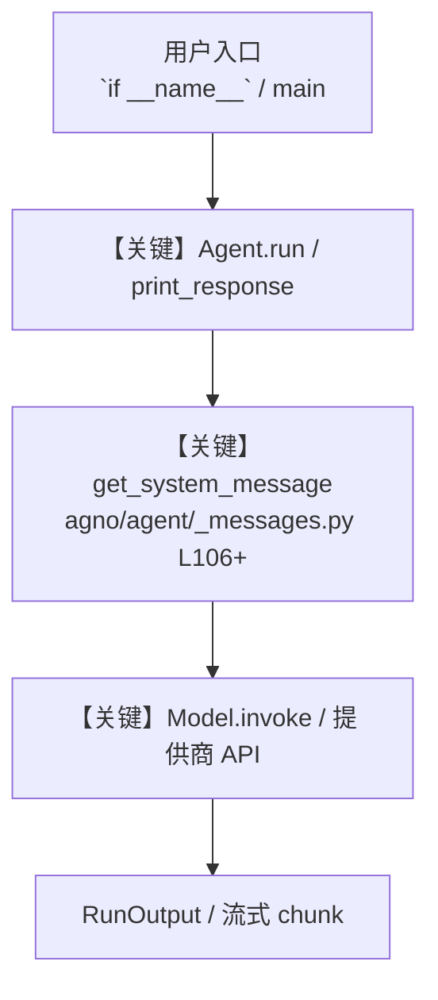

# game_concept_pitch.py — 实现原理分析

<!-- cookbook-py-source:start -->
## 完整源码

```python
"""
Game Concept Pitch - Generate Art and Structure a Pitch
=========================================================
Combines image generation, structured output, and a multi-agent team for a game pitch.

Steps used: 3 (Structured Output), 9 (Image Generation), 19 (Team)

Run:
    python cookbook/gemini_3/use_cases/game_concept_pitch.py
"""

from io import BytesIO
from pathlib import Path
from typing import List

from agno.agent import Agent, RunOutput
from agno.models.google import Gemini
from agno.team.team import Team
from pydantic import BaseModel, Field

# ---------------------------------------------------------------------------
# Workspace
# ---------------------------------------------------------------------------
WORKSPACE = Path(__file__).parent.parent.joinpath("workspace")
WORKSPACE.mkdir(parents=True, exist_ok=True)


# ---------------------------------------------------------------------------
# Output Schema for Game Pitch
# ---------------------------------------------------------------------------
class GamePitch(BaseModel):
    title: str = Field(..., description="Game title")
    tagline: str = Field(..., description="One-line hook (max 15 words)")
    genre: str = Field(
        ..., description="Primary genre (e.g., action RPG, puzzle platformer)"
    )
    platform: List[str] = Field(..., description="Target platforms")
    target_audience: str = Field(..., description="Target demographic")
    core_mechanic: str = Field(..., description="The one thing that makes the game fun")
    setting: str = Field(
        ..., description="World and setting description (2-3 sentences)"
    )
    unique_selling_points: List[str] = Field(
        ..., description="3-5 unique selling points"
    )
    comparable_titles: List[str] = Field(..., description="2-3 comparable games")
    monetization: str = Field(..., description="Monetization strategy")
    elevator_pitch: str = Field(..., description="Full elevator pitch (one paragraph)")


# ---------------------------------------------------------------------------
# Concept Art Agent (image generation)
# ---------------------------------------------------------------------------
art_agent = Agent(
    name="Concept Artist",
    model=Gemini(
        id="gemini-3-flash-preview",
        response_modalities=["Text", "Image"],
    ),
)

# ---------------------------------------------------------------------------
# Pitch Writer Agent (structured output)
# ---------------------------------------------------------------------------
pitch_writer = Agent(
    name="Pitch Writer",
    role="Write structured game concept pitches",
    model=Gemini(id="gemini-3.1-pro-preview"),
    instructions="""\
You are a game design consultant. Create compelling, structured game pitches.

## Rules

- Be specific about mechanics, not vague
- Comparable titles should be recent (last 3 years)
- Monetization must be realistic for the genre
- The tagline should make someone want to hear more
- No emojis\
""",
    output_schema=GamePitch,
    add_datetime_to_context=True,
)

# ---------------------------------------------------------------------------
# Review Team
# ---------------------------------------------------------------------------
market_analyst = Agent(
    name="Market Analyst",
    role="Evaluate market viability and competitive landscape",
    model=Gemini(id="gemini-3-flash-preview", search=True),
    instructions="""\
You analyze game market trends. Evaluate pitches for market viability.

## Evaluate

- Is there market demand for this genre?
- How crowded is the competitive space?
- Is the monetization realistic?
- What's the risk/reward profile?

## Rules

- Use recent market data
- Be honest about risks
- Suggest specific improvements
- No emojis\
""",
    add_datetime_to_context=True,
)

creative_director = Agent(
    name="Creative Director",
    role="Evaluate creative vision and player experience",
    model=Gemini(id="gemini-3-flash-preview"),
    instructions="""\
You evaluate game concepts for creative quality and player appeal.

## Evaluate

- Is the core mechanic fun and original?
- Does the setting support the gameplay?
- Will the target audience connect with this?
- What's the "wow factor"?

## Rules

- Focus on player experience
- Suggest improvements, not just criticism
- Consider accessibility
- No emojis\
""",
)

review_team = Team(
    name="Review Board",
    model=Gemini(id="gemini-3.1-pro-preview"),
    members=[market_analyst, creative_director],
    instructions="""\
You chair a game pitch review board with a Market Analyst and Creative Director.

## Process

1. Send the pitch to the Market Analyst for viability assessment
2. Send the pitch to the Creative Director for creative evaluation
3. Synthesize into a final review with:
   - **Market Assessment**: Viability and competitive analysis
   - **Creative Review**: Strengths and areas for improvement
   - **Final Verdict**: Go / Revise / Pass with reasoning\
""",
    show_members_responses=True,
    markdown=True,
)

# ---------------------------------------------------------------------------
# Run
# ---------------------------------------------------------------------------
if __name__ == "__main__":
    game_idea = (
        "A cozy underwater exploration game where you play as a marine biologist "
        "discovering and cataloging bioluminescent deep-sea creatures. "
        "The core loop is diving, photographing creatures, and building "
        "a living encyclopedia that other players can browse."
    )

    # Step 1: Generate concept art
    print("Generating concept art...\n")
    art_result = art_agent.run(
        f"Create concept art for this game: {game_idea}. "
        "Show a diver exploring a bioluminescent underwater cave with glowing creatures."
    )

    if art_result and isinstance(art_result, RunOutput) and art_result.images:
        try:
            from PIL import Image as PILImage

            for i, img in enumerate(art_result.images):
                if img.content:
                    image = PILImage.open(BytesIO(img.content))
                    path = WORKSPACE / f"game_concept_{i}.png"
                    image.save(str(path))
                    print(f"Saved concept art to {path}")
        except ImportError:
            print("Install Pillow to save images: pip install Pillow")

    # Step 2: Structure the pitch
    print("\nWriting game pitch...\n")
    pitch_result = pitch_writer.run(f"Create a structured game pitch for: {game_idea}")

    pitch: GamePitch = pitch_result.content
    print(f"Title: {pitch.title}")
    print(f"Tagline: {pitch.tagline}")
    print(f"Genre: {pitch.genre}")
    print(f"Core Mechanic: {pitch.core_mechanic}")
    print(f"\nElevator Pitch: {pitch.elevator_pitch}")

    # Step 3: Review the pitch
    print("\n\nRunning review board...\n")
    review_team.print_response(
        f"Review this game pitch:\n\n"
        f"Title: {pitch.title}\n"
        f"Genre: {pitch.genre}\n"
        f"Platforms: {', '.join(pitch.platform)}\n"
        f"Target Audience: {pitch.target_audience}\n"
        f"Core Mechanic: {pitch.core_mechanic}\n"
        f"Setting: {pitch.setting}\n"
        f"USPs: {', '.join(pitch.unique_selling_points)}\n"
        f"Comparable Titles: {', '.join(pitch.comparable_titles)}\n"
        f"Monetization: {pitch.monetization}\n"
        f"Elevator Pitch: {pitch.elevator_pitch}",
        stream=True,
    )
```

<!-- cookbook-py-source:end -->

> 源文件：`cookbook/gemini_3/use_cases/game_concept_pitch.py`

## 概述

Game Concept Pitch - Generate Art and Structure a Pitch

本示例归类：**Team 多智能体**；模型相关类型：`Gemini`。

**核心配置一览：**

| 配置项 | 值 | 说明 |
|--------|------|------|
| `name` | 'Concept Artist' | `Agent(...)` |
| `model` | Gemini(id='gemini-3-flash-preview'…) | `Agent(...)` |
| （Model 类） | `Gemini` | `agno.models` |

## 架构分层

```
用户 / cookbook 示例              Agno 框架
┌──────────────────────┐         ┌────────────────────────────────┐
│ game_concept_pitch.py │  ──▶  │ Agent → get_run_messages → Model │
└──────────────────────┘         └────────────────────────────────┘
                                          │
                                          ▼
                                  ┌───────────────┐
                                  │ 对应 Model 子类 │
                                  └───────────────┘
```

## 核心组件解析

### 运行机制与因果链

1. **入口**：从模块 `__main__` 或暴露的 `agent` / `team` 调用进入；同步用 `print_response` / `run`，异步用 `aprint_response` / `arun`（若源码中有）。
2. **消息**：默认路径下 system 内容由 `get_system_message()`（`libs/agno/agno/agent/_messages.py` 约 **L106** 起）按分段逻辑拼装；若显式传入 `system_message` 则早退使用该字符串。
3. **模型**：具体 HTTP/SDK 形态以 `libs/agno/agno/models/` 下对应类的 `invoke` / `ainvoke` 为准（勿默认写成单一 `chat.completions`）。
4. **副作用**：若配置 `db`、`knowledge`、`memory`，运行会读写存储；仅以本文件为准对照。

### 与框架的衔接

- **System**：`get_system_message()` 锚点 `agno/agent/_messages.py` **L106+**。
- **运行**：`Agent.print_response` 等入口 `agno/agent/agent.py`（以当前仓库检索为准）。

## System Prompt 组装

| 序号 | 组成部分 | 本文件 | 是否生效 |
|------|---------|--------|---------|
| 1 | `instructions` / `description` 等 | 见核心配置表与源码 | 有赋值则生效 |
| 2 | 默认分段（markdown、时间等） | 取决于 `Agent` 默认与显式参数 | 视参数 |

### 拼装顺序与源码锚点

1. `system_message` 直给 → 使用该内容（见 `_messages.py` 文档字符串分支说明）。
2. 否则默认拼装：`description`、`role`、`instructions`、markdown 附加段等按 `# 3.x` 注释顺序合并。

### 还原后的完整 System 文本

```text
（主 `Agent(...)` 未传入可静态解析的 `description`/`instructions`/`system_message` 字符串；此时 system 由 `get_system_message()` 默认段与 `markdown` 等开关决定，请在 `agno/agent/_messages.py` 对照分段注释，或在运行中打印 `get_system_message` 返回值。）
```

### 段落释义（模型视角）

- 指令与安全边界由 `instructions` / `system_message` 约束；若带 `tools` / `knowledge`，文档中需体现「何时检索/调用」由框架注入的提示段支持。

## 完整 API 请求

```python
# 请以本文件实际 Model 为准打开 libs/agno/agno/models/<厂商>/ 下对应类的 invoke：
# 可能是 chat.completions.create、responses.create、Gemini generate_content 等。
```

> 与上一节 system 文本在同一 run 中组合；`developer`/`system` 角色由适配器转换。



**【关键】节点说明：**

- **print_response / run**：用户可见的同步入口。
- **get_system_message**：系统提示拼装核心。
- **Model.invoke**：对模型提供商的实际请求。

## 关键源码文件索引

| 文件 | 作用 |
|------|------|
| `agno/agent/_messages.py` | `get_system_message()` L106+ |
| `agno/agent/agent.py` | `Agent` 运行与 CLI 输出 |
| `agno/models/` | 各厂商 `Model.invoke` |
