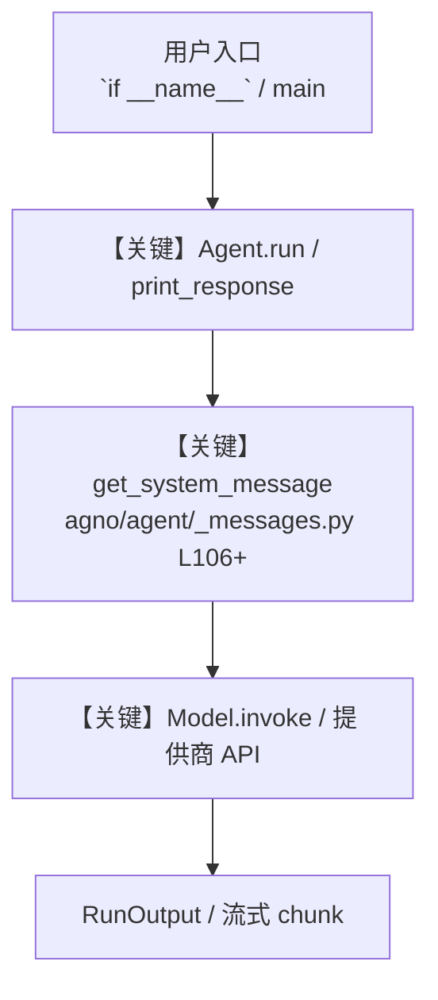

# music_asset_brief.py — 实现原理分析

<!-- cookbook-py-source:start -->
## 完整源码

```python
"""
Music Asset Brief - Analyze a Track and Produce a Brief
=========================================================
Combines audio analysis, image understanding, web search, and structured output for a music brief.

Steps used: 2 (Tools), 3 (Structured Output), 8 (Image), 10 (Audio)

Run:
    python cookbook/gemini_3/use_cases/music_asset_brief.py
"""

from typing import List

import httpx
from agno.agent import Agent
from agno.media import Audio, Image
from agno.models.google import Gemini
from agno.tools.websearch import WebSearchTools
from pydantic import BaseModel, Field


# ---------------------------------------------------------------------------
# Output Schema
# ---------------------------------------------------------------------------
class TrackBrief(BaseModel):
    track_name: str = Field(..., description="Name of the track")
    artist: str = Field(..., description="Artist or band name")
    genre: str = Field(..., description="Primary genre")
    mood: str = Field(..., description="Overall mood (e.g., energetic, melancholic)")
    tempo_estimate: str = Field(..., description="Estimated tempo (slow, mid, fast)")
    visual_style: str = Field(..., description="Visual style of the artwork")
    target_audience: str = Field(..., description="Suggested target audience")
    marketing_angles: List[str] = Field(..., description="3-5 marketing angles")
    comparable_artists: List[str] = Field(..., description="2-3 comparable artists")
    summary: str = Field(..., description="One-paragraph executive summary")


# ---------------------------------------------------------------------------
# Agent Instructions
# ---------------------------------------------------------------------------
instructions = """\
You are a music industry analyst. You analyze tracks, artwork, and market
context to produce comprehensive asset briefs for A&R and marketing teams.

## Workflow

1. If audio is provided, analyze the track: genre, mood, tempo, production style
2. If an image is provided, analyze the artwork: visual style, themes, color palette
3. Search the web for the artist and current market context
4. Produce a structured brief combining all insights

## Rules

- Be specific about genre (not just "pop", say "synth-pop" or "indie pop")
- Name comparable artists that are currently relevant
- Marketing angles should be actionable
- No emojis\
"""

# ---------------------------------------------------------------------------
# Create Agent
# ---------------------------------------------------------------------------
music_analyst = Agent(
    name="Music Analyst",
    model=Gemini(id="gemini-3-flash-preview"),
    instructions=instructions,
    tools=[WebSearchTools()],
    output_schema=TrackBrief,
    add_datetime_to_context=True,
)

# ---------------------------------------------------------------------------
# Run
# ---------------------------------------------------------------------------
if __name__ == "__main__":
    # Sample: analyze a track with audio and artwork
    # Replace these with your own audio URL and artwork URL
    audio_url = "https://agno-public.s3.amazonaws.com/demo/sample-audio.mp3"
    artwork_url = "https://agno-public.s3.amazonaws.com/images/krakow_mariacki.jpg"

    print("Downloading audio sample...")
    audio_response = httpx.get(audio_url)

    print("Analyzing track and artwork...\n")
    result = music_analyst.run(
        "Analyze this music track and album artwork. "
        "Research the artist and produce a comprehensive asset brief.",
        audio=[Audio(content=audio_response.content, format="mp3")],
        images=[Image(url=artwork_url)],
    )

    brief: TrackBrief = result.content
    print(f"Track: {brief.track_name} by {brief.artist}")
    print(f"Genre: {brief.genre} | Mood: {brief.mood} | Tempo: {brief.tempo_estimate}")
    print(f"Visual Style: {brief.visual_style}")
    print(f"Target Audience: {brief.target_audience}")
    print("\nMarketing Angles:")
    for angle in brief.marketing_angles:
        print(f"  - {angle}")
    print(f"\nComparable Artists: {', '.join(brief.comparable_artists)}")
    print(f"\nSummary: {brief.summary}")
```

<!-- cookbook-py-source:end -->

> 源文件：`cookbook/gemini_3/use_cases/music_asset_brief.py`

## 概述

Music Asset Brief - Analyze a Track and Produce a Brief

本示例归类：**单 Agent**；模型相关类型：`Gemini`。

**核心配置一览：**

| 配置项 | 值 | 说明 |
|--------|------|------|
| `name` | 'Music Analyst' | `Agent(...)` |
| `model` | Gemini(id='gemini-3-flash-preview'…) | `Agent(...)` |
| `instructions` | 'You are a music industry analyst. You analyze tracks, artwork, and market\ncontext to produce comprehensive asset brie...' | `Agent(...)` |
| `output_schema` | 变量 `TrackBrief` | `Agent(...)` |
| `add_datetime_to_context` | True | `Agent(...)` |
| （Model 类） | `Gemini` | `agno.models` |

## 架构分层

```
用户 / cookbook 示例              Agno 框架
┌──────────────────────┐         ┌────────────────────────────────┐
│ music_asset_brief.py │  ──▶  │ Agent → get_run_messages → Model │
└──────────────────────┘         └────────────────────────────────┘
                                          │
                                          ▼
                                  ┌───────────────┐
                                  │ 对应 Model 子类 │
                                  └───────────────┘
```

## 核心组件解析

### 运行机制与因果链

1. **入口**：从模块 `__main__` 或暴露的 `agent` / `team` 调用进入；同步用 `print_response` / `run`，异步用 `aprint_response` / `arun`（若源码中有）。
2. **消息**：默认路径下 system 内容由 `get_system_message()`（`libs/agno/agno/agent/_messages.py` 约 **L106** 起）按分段逻辑拼装；若显式传入 `system_message` 则早退使用该字符串。
3. **模型**：具体 HTTP/SDK 形态以 `libs/agno/agno/models/` 下对应类的 `invoke` / `ainvoke` 为准（勿默认写成单一 `chat.completions`）。
4. **副作用**：若配置 `db`、`knowledge`、`memory`，运行会读写存储；仅以本文件为准对照。

### 与框架的衔接

- **System**：`get_system_message()` 锚点 `agno/agent/_messages.py` **L106+**。
- **运行**：`Agent.print_response` 等入口 `agno/agent/agent.py`（以当前仓库检索为准）。

## System Prompt 组装

| 序号 | 组成部分 | 本文件 | 是否生效 |
|------|---------|--------|---------|
| 1 | `instructions` / `description` 等 | 见核心配置表与源码 | 有赋值则生效 |
| 2 | 默认分段（markdown、时间等） | 取决于 `Agent` 默认与显式参数 | 视参数 |

### 拼装顺序与源码锚点

1. `system_message` 直给 → 使用该内容（见 `_messages.py` 文档字符串分支说明）。
2. 否则默认拼装：`description`、`role`、`instructions`、markdown 附加段等按 `# 3.x` 注释顺序合并。

### 还原后的完整 System 文本

```text
--- instructions ---
You are a music industry analyst. You analyze tracks, artwork, and market
context to produce comprehensive asset briefs for A&R and marketing teams.

## Workflow

1. If audio is provided, analyze the track: genre, mood, tempo, production style
2. If an image is provided, analyze the artwork: visual style, themes, color palette
3. Search the web for the artist and current market context
4. Produce a structured brief combining all insights

## Rules

- Be specific about genre (not just "pop", say "synth-pop" or "indie pop")
- Name comparable artists that are currently relevant
- Marketing angles should be actionable
- No emojis
```

### 段落释义（模型视角）

- 指令与安全边界由 `instructions` / `system_message` 约束；若带 `tools` / `knowledge`，文档中需体现「何时检索/调用」由框架注入的提示段支持。

## 完整 API 请求

```python
# 请以本文件实际 Model 为准打开 libs/agno/agno/models/<厂商>/ 下对应类的 invoke：
# 可能是 chat.completions.create、responses.create、Gemini generate_content 等。
```

> 与上一节 system 文本在同一 run 中组合；`developer`/`system` 角色由适配器转换。



**【关键】节点说明：**

- **print_response / run**：用户可见的同步入口。
- **get_system_message**：系统提示拼装核心。
- **Model.invoke**：对模型提供商的实际请求。

## 关键源码文件索引

| 文件 | 作用 |
|------|------|
| `agno/agent/_messages.py` | `get_system_message()` L106+ |
| `agno/agent/agent.py` | `Agent` 运行与 CLI 输出 |
| `agno/models/` | 各厂商 `Model.invoke` |
