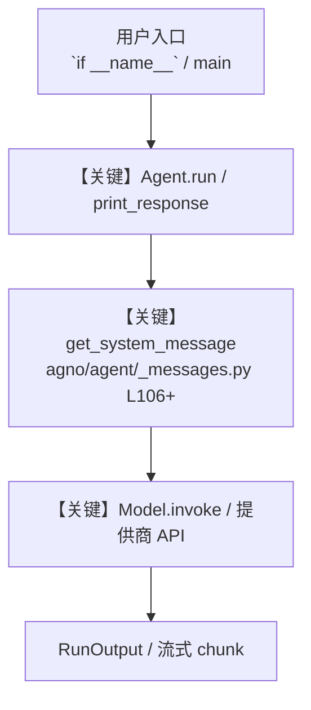

# level_2_storage_knowledge.py — 实现原理分析

<!-- cookbook-py-source:start -->
## 完整源码

```python
"""
Level 2: Agent with storage and knowledge
======================================
Add persistent storage and a searchable knowledge base.
The agent can recall conversations and use domain knowledge.

This builds on Level 1 by adding:
- Storage: SqliteDb for conversation history across sessions
- Knowledge: ChromaDb with hybrid search for domain knowledge

Run standalone:
    python cookbook/levels_of_agentic_software/level_2_storage_knowledge.py

Run via Agent OS:
    python cookbook/levels_of_agentic_software/run.py
    Then visit https://os.agno.com and select "L2 Coding Agent"

Example prompt:
    "Write a CSV parser following our coding conventions"
"""

from pathlib import Path

from agno.agent import Agent
from agno.db.sqlite import SqliteDb
from agno.knowledge import Knowledge
from agno.knowledge.embedder.openai import OpenAIEmbedder
from agno.models.openai import OpenAIResponses
from agno.tools.coding import CodingTools
from agno.vectordb.chroma import ChromaDb, SearchType

# ---------------------------------------------------------------------------
# Workspace
# ---------------------------------------------------------------------------
WORKSPACE = Path(__file__).parent.joinpath("workspace")
WORKSPACE.mkdir(parents=True, exist_ok=True)

# ---------------------------------------------------------------------------
# Storage and Knowledge
# ---------------------------------------------------------------------------
db = SqliteDb(db_file=str(WORKSPACE / "agents.db"))

knowledge = Knowledge(
    name="L2 Coding Agent Knowledge",
    vector_db=ChromaDb(
        collection="coding-standards",
        path=str(WORKSPACE / "chromadb"),
        persistent_client=True,
        search_type=SearchType.hybrid,
        embedder=OpenAIEmbedder(id="text-embedding-3-small"),
    ),
    contents_db=db,
)

# ---------------------------------------------------------------------------
# Agent Instructions
# ---------------------------------------------------------------------------
instructions = """\
You are a coding agent with access to domain knowledge.

## Workflow

1. Search your knowledge base for relevant domain knowledge
2. Understand the task
3. Write code that follows the domain knowledge
4. Save the code to a file and run it to verify
5. If there are errors, fix them and re-run

## Rules

- Always search knowledge before writing code
- Follow domain knowledge found in the knowledge base
- Save code to files before running
- Include type hints and docstrings
- No emojis\
"""

# ---------------------------------------------------------------------------
# Create Agent
# ---------------------------------------------------------------------------
l2_coding_agent = Agent(
    name="L2 Coding Agent",
    model=OpenAIResponses(id="gpt-5.2"),
    instructions=instructions,
    tools=[CodingTools(base_dir=WORKSPACE, all=True)],
    knowledge=knowledge,
    search_knowledge=True,
    db=db,
    add_history_to_context=True,
    num_history_runs=3,
    markdown=True,
    add_datetime_to_context=True,
)

# ---------------------------------------------------------------------------
# Run Agent
# ---------------------------------------------------------------------------
if __name__ == "__main__":
    # Step 1: Load project conventions into the knowledge base
    print("Loading domain knowledge into knowledge base...")
    knowledge.insert(
        text_content="""\
## Domain Knowledge

### Style
- Use snake_case for all function and variable names
- Use type hints on all function signatures
- Write docstrings in Google style format
- Prefer list comprehensions over map/filter
- Maximum line length: 88 characters (Black formatter default)

### Error Handling
- Use specific exception types, never bare except
- Always include a meaningful error message
- Use logging instead of print for non-output messages

### File I/O
- Use pathlib.Path instead of os.path
- Use context managers (with statements) for file operations
- Default encoding: utf-8

### Testing
- Include example usage in a __main__ block
- Test edge cases: empty input, single element, large input
""",
    )

    # Step 2: Ask the agent to write code following conventions
    print("\n--- Session 1: Write code following conventions ---\n")
    l2_coding_agent.print_response(
        "Write a CSV parser that reads a CSV file and returns a list of "
        "dictionaries. Follow our project conventions. Save it to csv_parser.py "
        "and test it with sample data.",
        user_id="dev@example.com",
        session_id="session_1",
        stream=True,
    )

    # Step 3: Follow-up in the same session (agent has context)
    print("\n--- Session 1: Follow-up question ---\n")
    l2_coding_agent.print_response(
        "Add a function to write dictionaries back to CSV format.",
        user_id="dev@example.com",
        session_id="session_1",
        stream=True,
    )
```

<!-- cookbook-py-source:end -->

> 源文件：`cookbook/levels_of_agentic_software/level_2_storage_knowledge.py`

## 概述

Level 2: Agent with storage and knowledge

本示例归类：**单 Agent**；模型相关类型：`OpenAIResponses`。

**核心配置一览：**

| 配置项 | 值 | 说明 |
|--------|------|------|
| `name` | 'L2 Coding Agent' | `Agent(...)` |
| `model` | OpenAIResponses(id='gpt-5.2'…) | `Agent(...)` |
| `instructions` | 'You are a coding agent with access to domain knowledge.\n\n## Workflow\n\n1. Search your knowledge base for relevant doma...' | `Agent(...)` |
| `knowledge` | 变量 `knowledge` | `Agent(...)` |
| `search_knowledge` | True | `Agent(...)` |
| `db` | 变量 `db` | `Agent(...)` |
| `add_history_to_context` | True | `Agent(...)` |
| `num_history_runs` | 3 | `Agent(...)` |
| `markdown` | True | `Agent(...)` |
| `add_datetime_to_context` | True | `Agent(...)` |
| （Model 类） | `OpenAIResponses` | `agno.models` |

## 架构分层

```
用户 / cookbook 示例              Agno 框架
┌──────────────────────┐         ┌────────────────────────────────┐
│ level_2_storage_knowledge.py │  ──▶  │ Agent → get_run_messages → Model │
└──────────────────────┘         └────────────────────────────────┘
                                          │
                                          ▼
                                  ┌───────────────┐
                                  │ 对应 Model 子类 │
                                  └───────────────┘
```

## 核心组件解析

### 运行机制与因果链

1. **入口**：从模块 `__main__` 或暴露的 `agent` / `team` 调用进入；同步用 `print_response` / `run`，异步用 `aprint_response` / `arun`（若源码中有）。
2. **消息**：默认路径下 system 内容由 `get_system_message()`（`libs/agno/agno/agent/_messages.py` 约 **L106** 起）按分段逻辑拼装；若显式传入 `system_message` 则早退使用该字符串。
3. **模型**：具体 HTTP/SDK 形态以 `libs/agno/agno/models/` 下对应类的 `invoke` / `ainvoke` 为准（勿默认写成单一 `chat.completions`）。
4. **副作用**：若配置 `db`、`knowledge`、`memory`，运行会读写存储；仅以本文件为准对照。

### 与框架的衔接

- **System**：`get_system_message()` 锚点 `agno/agent/_messages.py` **L106+**。
- **运行**：`Agent.print_response` 等入口 `agno/agent/agent.py`（以当前仓库检索为准）。

## System Prompt 组装

| 序号 | 组成部分 | 本文件 | 是否生效 |
|------|---------|--------|---------|
| 1 | `instructions` / `description` 等 | 见核心配置表与源码 | 有赋值则生效 |
| 2 | 默认分段（markdown、时间等） | 取决于 `Agent` 默认与显式参数 | 视参数 |

### 拼装顺序与源码锚点

1. `system_message` 直给 → 使用该内容（见 `_messages.py` 文档字符串分支说明）。
2. 否则默认拼装：`description`、`role`、`instructions`、markdown 附加段等按 `# 3.x` 注释顺序合并。

### 还原后的完整 System 文本

```text
--- instructions ---
You are a coding agent with access to domain knowledge.

## Workflow

1. Search your knowledge base for relevant domain knowledge
2. Understand the task
3. Write code that follows the domain knowledge
4. Save the code to a file and run it to verify
5. If there are errors, fix them and re-run

## Rules

- Always search knowledge before writing code
- Follow domain knowledge found in the knowledge base
- Save code to files before running
- Include type hints and docstrings
- No emojis
```

### 段落释义（模型视角）

- 指令与安全边界由 `instructions` / `system_message` 约束；若带 `tools` / `knowledge`，文档中需体现「何时检索/调用」由框架注入的提示段支持。

## 完整 API 请求

```python
# 请以本文件实际 Model 为准打开 libs/agno/agno/models/<厂商>/ 下对应类的 invoke：
# 可能是 chat.completions.create、responses.create、Gemini generate_content 等。
```

> 与上一节 system 文本在同一 run 中组合；`developer`/`system` 角色由适配器转换。



**【关键】节点说明：**

- **print_response / run**：用户可见的同步入口。
- **get_system_message**：系统提示拼装核心。
- **Model.invoke**：对模型提供商的实际请求。

## 关键源码文件索引

| 文件 | 作用 |
|------|------|
| `agno/agent/_messages.py` | `get_system_message()` L106+ |
| `agno/agent/agent.py` | `Agent` 运行与 CLI 输出 |
| `agno/models/` | 各厂商 `Model.invoke` |
