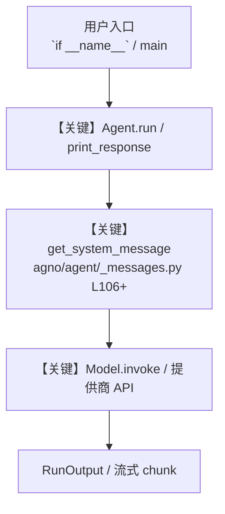

# level_4_team.py — 实现原理分析

<!-- cookbook-py-source:start -->
## 完整源码

```python
"""
Level 4: Multi-agent Team
===========================
Split responsibilities across specialized agents coordinated by a team leader.
Coder writes, Reviewer critiques, Tester validates.

This takes a different architectural path from the single-agent levels:
- Multiple specialized agents with distinct roles
- A Team leader that coordinates and synthesizes

Honest caveat: Multi-agent teams are powerful but less predictable than
single agents. The team leader is an LLM making delegation decisions --
sometimes brilliantly, sometimes not. For production automation, prefer
explicit workflows. Teams shine in human-supervised settings.

Run standalone:
    python cookbook/levels_of_agentic_software/level_4_team.py

Run via Agent OS:
    python cookbook/levels_of_agentic_software/run.py
    Then visit https://os.agno.com and select "L4 Coding Team"

Example prompt:
    "Build a stack data structure with full test coverage"
"""

from pathlib import Path

from agno.agent import Agent
from agno.db.sqlite import SqliteDb
from agno.models.openai import OpenAIResponses
from agno.team.team import Team
from agno.tools.coding import CodingTools

# ---------------------------------------------------------------------------
# Workspace
# ---------------------------------------------------------------------------
WORKSPACE = Path(__file__).parent.joinpath("workspace")
WORKSPACE.mkdir(parents=True, exist_ok=True)

# ---------------------------------------------------------------------------
# Storage
# ---------------------------------------------------------------------------
db = SqliteDb(db_file=str(WORKSPACE / "agents.db"))

# ---------------------------------------------------------------------------
# Coder Agent -- writes code
# ---------------------------------------------------------------------------
coder = Agent(
    name="L4 Coder",
    role="Write code based on requirements",
    model=OpenAIResponses(id="gpt-5.2"),
    instructions="""\
You are a senior developer. Write clean, well-documented code.

## Workflow
1. Understand the requirements
2. Write the implementation with type hints and docstrings
3. Save the code to a file

## Rules
- Write production-quality code
- Include type hints and Google-style docstrings
- Handle edge cases
- No emojis\
""",
    tools=[CodingTools(base_dir=WORKSPACE, all=True)],
    db=db,
    add_datetime_to_context=True,
)

# ---------------------------------------------------------------------------
# Reviewer Agent -- reviews code (read-only tools)
# ---------------------------------------------------------------------------
reviewer = Agent(
    name="L4 Reviewer",
    role="Review code for quality, bugs, and best practices",
    model=OpenAIResponses(id="gpt-5.2"),
    instructions="""\
You are a senior code reviewer. Provide thorough, constructive reviews.

## Workflow
1. Read the code files
2. Check for bugs, edge cases, and style issues
3. Provide specific, actionable feedback

## Review Checklist
- Correctness: Does it handle edge cases?
- Style: Consistent naming, proper type hints?
- Documentation: Clear docstrings?
- Performance: Any obvious inefficiencies?

## Rules
- Be specific -- reference line numbers and code
- Suggest fixes, not just problems
- Acknowledge what's done well
- No emojis\
""",
    tools=[
        CodingTools(
            base_dir=WORKSPACE,
            enable_read_file=True,
            enable_grep=True,
            enable_find=True,
            enable_ls=True,
            enable_write_file=False,
            enable_edit_file=False,
            enable_run_shell=False,
        ),
    ],
    db=db,
    add_datetime_to_context=True,
)

# ---------------------------------------------------------------------------
# Tester Agent -- writes and runs tests
# ---------------------------------------------------------------------------
tester = Agent(
    name="L4 Tester",
    role="Write and run tests for the code",
    model=OpenAIResponses(id="gpt-5.2"),
    instructions="""\
You are a QA engineer. Write thorough tests and run them.

## Workflow
1. Read the implementation code
2. Write tests covering normal cases, edge cases, and error cases
3. Save tests to a test file
4. Run the tests and report results

## Rules
- Test both happy path and edge cases
- Test error handling
- Use assert statements with clear messages
- No emojis\
""",
    tools=[CodingTools(base_dir=WORKSPACE, all=True)],
    db=db,
    add_datetime_to_context=True,
)

# ---------------------------------------------------------------------------
# Create Team
# ---------------------------------------------------------------------------
l4_coding_team = Team(
    name="L4 Coding Team",
    model=OpenAIResponses(id="gpt-5.2"),
    members=[coder, reviewer, tester],
    instructions="""\
You lead a coding team with a Coder, Reviewer, and Tester.

## Process

1. Send the task to the Coder to implement
2. Send the code to the Reviewer for feedback
3. If the Reviewer finds issues, send back to the Coder to fix
4. Send the final code to the Tester to write and run tests
5. Synthesize results into a final report

## Output Format

Provide a summary with:
- **Implementation**: What was built and key design decisions
- **Review**: Key findings from the code review
- **Tests**: Test results and coverage
- **Status**: Overall pass/fail assessment\
""",
    db=db,
    show_members_responses=True,
    add_datetime_to_context=True,
    markdown=True,
)

# ---------------------------------------------------------------------------
# Run Demo
# ---------------------------------------------------------------------------
if __name__ == "__main__":
    l4_coding_team.print_response(
        "Build a Stack data structure in Python with push, pop, peek, "
        "is_empty, and size methods. Include proper error handling for "
        "operations on an empty stack. Save to stack.py and write tests "
        "in test_stack.py.",
        stream=True,
    )
```

<!-- cookbook-py-source:end -->

> 源文件：`cookbook/levels_of_agentic_software/level_4_team.py`

## 概述

Level 4: Multi-agent Team

本示例归类：**Team 多智能体**；模型相关类型：`OpenAIResponses`。

**核心配置一览：**

| 配置项 | 值 | 说明 |
|--------|------|------|
| `name` | 'L4 Coder' | `Agent(...)` |
| `role` | 'Write code based on requirements' | `Agent(...)` |
| `model` | OpenAIResponses(id='gpt-5.2'…) | `Agent(...)` |
| `instructions` | 'You are a senior developer. Write clean, well-documented code.\n\n## Workflow\n1. Understand the requirements\n2. Write the implementation with type hints and docstrings\n3. Save the code to a file\n\n## ...' | `Agent(...)` |
| `db` | 变量 `db` | `Agent(...)` |
| `add_datetime_to_context` | True | `Agent(...)` |
| （Model 类） | `OpenAIResponses` | `agno.models` |

## 架构分层

```
用户 / cookbook 示例              Agno 框架
┌──────────────────────┐         ┌────────────────────────────────┐
│ level_4_team.py      │  ──▶  │ Agent → get_run_messages → Model │
└──────────────────────┘         └────────────────────────────────┘
                                          │
                                          ▼
                                  ┌───────────────┐
                                  │ 对应 Model 子类 │
                                  └───────────────┘
```

## 核心组件解析

### 运行机制与因果链

1. **入口**：从模块 `__main__` 或暴露的 `agent` / `team` 调用进入；同步用 `print_response` / `run`，异步用 `aprint_response` / `arun`（若源码中有）。
2. **消息**：默认路径下 system 内容由 `get_system_message()`（`libs/agno/agno/agent/_messages.py` 约 **L106** 起）按分段逻辑拼装；若显式传入 `system_message` 则早退使用该字符串。
3. **模型**：具体 HTTP/SDK 形态以 `libs/agno/agno/models/` 下对应类的 `invoke` / `ainvoke` 为准（勿默认写成单一 `chat.completions`）。
4. **副作用**：若配置 `db`、`knowledge`、`memory`，运行会读写存储；仅以本文件为准对照。

### 与框架的衔接

- **System**：`get_system_message()` 锚点 `agno/agent/_messages.py` **L106+**。
- **运行**：`Agent.print_response` 等入口 `agno/agent/agent.py`（以当前仓库检索为准）。

## System Prompt 组装

| 序号 | 组成部分 | 本文件 | 是否生效 |
|------|---------|--------|---------|
| 1 | `instructions` / `description` 等 | 见核心配置表与源码 | 有赋值则生效 |
| 2 | 默认分段（markdown、时间等） | 取决于 `Agent` 默认与显式参数 | 视参数 |

### 拼装顺序与源码锚点

1. `system_message` 直给 → 使用该内容（见 `_messages.py` 文档字符串分支说明）。
2. 否则默认拼装：`description`、`role`、`instructions`、markdown 附加段等按 `# 3.x` 注释顺序合并。

### 还原后的完整 System 文本

```text
--- role ---
Write code based on requirements

--- instructions ---
You are a senior developer. Write clean, well-documented code.

## Workflow
1. Understand the requirements
2. Write the implementation with type hints and docstrings
3. Save the code to a file

## Rules
- Write production-quality code
- Include type hints and Google-style docstrings
- Handle edge cases
- No emojis
```

### 段落释义（模型视角）

- 指令与安全边界由 `instructions` / `system_message` 约束；若带 `tools` / `knowledge`，文档中需体现「何时检索/调用」由框架注入的提示段支持。

## 完整 API 请求

```python
# 请以本文件实际 Model 为准打开 libs/agno/agno/models/<厂商>/ 下对应类的 invoke：
# 可能是 chat.completions.create、responses.create、Gemini generate_content 等。
```

> 与上一节 system 文本在同一 run 中组合；`developer`/`system` 角色由适配器转换。



**【关键】节点说明：**

- **print_response / run**：用户可见的同步入口。
- **get_system_message**：系统提示拼装核心。
- **Model.invoke**：对模型提供商的实际请求。

## 关键源码文件索引

| 文件 | 作用 |
|------|------|
| `agno/agent/_messages.py` | `get_system_message()` L106+ |
| `agno/agent/agent.py` | `Agent` 运行与 CLI 输出 |
| `agno/models/` | 各厂商 `Model.invoke` |
