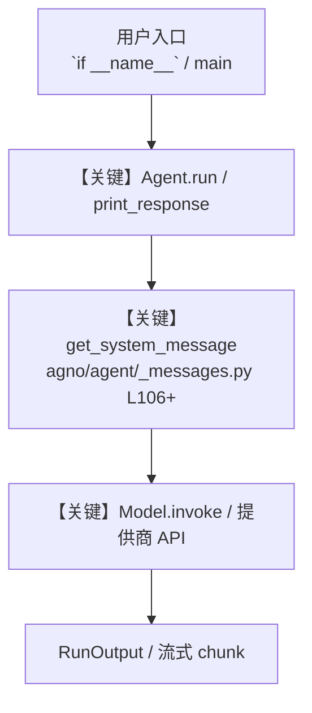

# run.py — 实现原理分析

<!-- cookbook-py-source:start -->
## 完整源码

```python
"""
Agent OS - Web Interface for the 5 Levels of Agentic Software
===============================================================
This file starts an Agent OS server that provides a web interface for
all 5 levels of agentic software from this cookbook.

All levels are available in the Agent OS UI. Level 5 is the most complete,
with production databases, learning, and tracing. Levels 1-4 are included
so you can compare the progression and test each stage interactively.

How to Use
----------
1. Start PostgreSQL (required for Level 5):
   ./cookbook/scripts/run_pgvector.sh

2. Start the server:
   python cookbook/levels_of_agentic_software/run.py

3. Visit https://os.agno.com in your browser

4. Add your local endpoint: http://localhost:7777

5. Select any agent or team and start chatting:
   - L1 Coding Agent: Stateless tool calling (no setup needed)
   - L2 Coding Agent: Knowledge + storage (ChromaDb + SQLite)
   - L3 Coding Agent: Memory + learning (learns from interactions)
   - L4 Coding Team: Multi-agent team (Coder/Reviewer/Tester)
   - L5 Coding Agent: Production system (PostgreSQL + PgVector + tracing)

Prerequisites
-------------
- PostgreSQL with PgVector running on port 5532 (for Level 5)
- OPENAI_API_KEY environment variable set
"""

from pathlib import Path

from agno.os import AgentOS
from level_1_tools import l1_coding_agent
from level_2_storage_knowledge import l2_coding_agent
from level_3_memory_learning import l3_coding_agent
from level_4_team import l4_coding_team
from level_5_api import l5_coding_agent

# ---------------------------------------------------------------------------
# AgentOS Config
# ---------------------------------------------------------------------------
config_path = str(Path(__file__).parent.joinpath("config.yaml"))

# ---------------------------------------------------------------------------
# Create AgentOS
# ---------------------------------------------------------------------------
# All levels are registered so users can compare the progression.
# Level 5 is the most complete — start there for the full experience.
agent_os = AgentOS(
    id="Coding Agent OS",
    agents=[l1_coding_agent, l2_coding_agent, l3_coding_agent, l5_coding_agent],
    teams=[l4_coding_team],
    config=config_path,
    tracing=True,
)
app = agent_os.get_app()

# ---------------------------------------------------------------------------
# Run AgentOS
# ---------------------------------------------------------------------------
if __name__ == "__main__":
    agent_os.serve(app="run:app", reload=True)
```

<!-- cookbook-py-source:end -->

> 源文件：`cookbook/levels_of_agentic_software/run.py`

## 概述

Agent OS - Web Interface for the 5 Levels of Agentic Software

本示例归类：**脚本/工具入口**；模型相关类型：`（见源码 import）`。

**核心配置一览：**

| 配置项 | 值 | 说明 |
|--------|------|------|
| （见源码） | — | 请展开 `Agent` / `Team` 构造参数 |

## 架构分层

```
用户 / cookbook 示例              Agno 框架
┌──────────────────────┐         ┌────────────────────────────────┐
│ run.py               │  ──▶  │ Agent → get_run_messages → Model │
└──────────────────────┘         └────────────────────────────────┘
                                          │
                                          ▼
                                  ┌───────────────┐
                                  │ 对应 Model 子类 │
                                  └───────────────┘
```

## 核心组件解析

### 运行机制与因果链

1. **入口**：从模块 `__main__` 或暴露的 `agent` / `team` 调用进入；同步用 `print_response` / `run`，异步用 `aprint_response` / `arun`（若源码中有）。
2. **消息**：默认路径下 system 内容由 `get_system_message()`（`libs/agno/agno/agent/_messages.py` 约 **L106** 起）按分段逻辑拼装；若显式传入 `system_message` 则早退使用该字符串。
3. **模型**：具体 HTTP/SDK 形态以 `libs/agno/agno/models/` 下对应类的 `invoke` / `ainvoke` 为准（勿默认写成单一 `chat.completions`）。
4. **副作用**：若配置 `db`、`knowledge`、`memory`，运行会读写存储；仅以本文件为准对照。

### 与框架的衔接

- **System**：`get_system_message()` 锚点 `agno/agent/_messages.py` **L106+**。
- **运行**：`Agent.print_response` 等入口 `agno/agent/agent.py`（以当前仓库检索为准）。

## System Prompt 组装

| 序号 | 组成部分 | 本文件 | 是否生效 |
|------|---------|--------|---------|
| 1 | `instructions` / `description` 等 | 见核心配置表与源码 | 有赋值则生效 |
| 2 | 默认分段（markdown、时间等） | 取决于 `Agent` 默认与显式参数 | 视参数 |

### 拼装顺序与源码锚点

1. `system_message` 直给 → 使用该内容（见 `_messages.py` 文档字符串分支说明）。
2. 否则默认拼装：`description`、`role`、`instructions`、markdown 附加段等按 `# 3.x` 注释顺序合并。

### 还原后的完整 System 文本

```text
（本文件未出现 `Agent(...)` 构造；可能为脚本、工具封装或 MCP 服务，详见源码逻辑。）
```

### 段落释义（模型视角）

- 指令与安全边界由 `instructions` / `system_message` 约束；若带 `tools` / `knowledge`，文档中需体现「何时检索/调用」由框架注入的提示段支持。

## 完整 API 请求

```python
# 请以本文件实际 Model 为准打开 libs/agno/agno/models/<厂商>/ 下对应类的 invoke：
# 可能是 chat.completions.create、responses.create、Gemini generate_content 等。
```

> 与上一节 system 文本在同一 run 中组合；`developer`/`system` 角色由适配器转换。



**【关键】节点说明：**

- **print_response / run**：用户可见的同步入口。
- **get_system_message**：系统提示拼装核心。
- **Model.invoke**：对模型提供商的实际请求。

## 关键源码文件索引

| 文件 | 作用 |
|------|------|
| `agno/agent/_messages.py` | `get_system_message()` L106+ |
| `agno/agent/agent.py` | `Agent` 运行与 CLI 输出 |
| `agno/models/` | 各厂商 `Model.invoke` |
