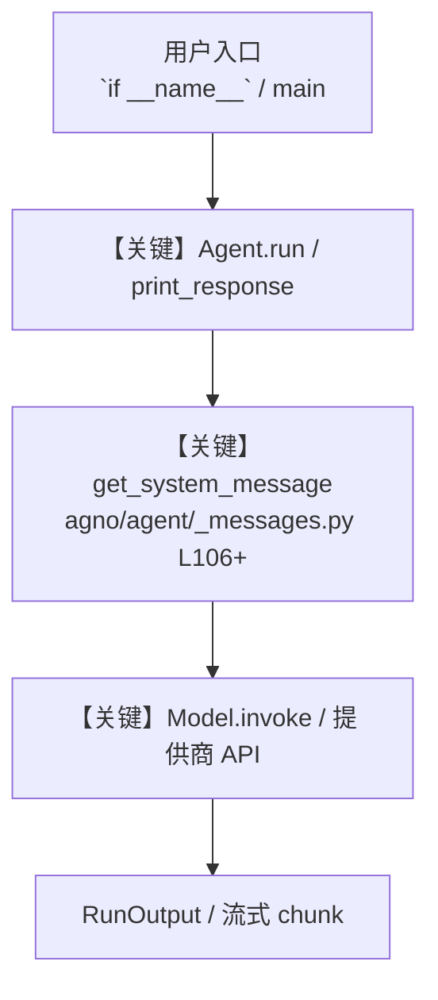

# check_cookbook_pattern.py — 实现原理分析

<!-- cookbook-py-source:start -->
## 完整源码

```python
#!/usr/bin/env python3
"""Validate cookbook Python example structure.

This checker enforces a lightweight, teachable pattern for runnable cookbook
examples:
1. Module docstring at top.
2. Sectioned layout using banner comments.
3. A "Create ..." section and a "Run ..." section, in that order.
4. Main execution gate: if __name__ == "__main__":.
5. No emoji characters in Python source.
"""

from __future__ import annotations

import argparse
import ast
import json
import re
from dataclasses import asdict, dataclass
from pathlib import Path

EMOJI_RE = re.compile(r"[\U0001F300-\U0001FAFF]")
MAIN_GATE_RE = re.compile(r'if __name__ == ["\']__main__["\']:')
SECTION_RE = re.compile(r"^# [-=]+\n# (?P<title>.+?)\n# [-=]+$", re.MULTILINE)
SKIP_FILE_NAMES = {"__init__.py"}
SKIP_DIR_NAMES = {"__pycache__", ".git", ".context"}


@dataclass
class Violation:
    path: str
    line: int
    code: str
    message: str


def iter_python_files(base_dir: Path, recursive: bool) -> list[Path]:
    pattern = "**/*.py" if recursive else "*.py"
    files: list[Path] = []
    for path in sorted(base_dir.glob(pattern)):
        if not path.is_file():
            continue
        if path.name in SKIP_FILE_NAMES:
            continue
        if any(part in SKIP_DIR_NAMES for part in path.parts):
            continue
        files.append(path)
    return files


def find_sections(text: str) -> list[tuple[str, int]]:
    sections: list[tuple[str, int]] = []
    for match in SECTION_RE.finditer(text):
        title = match.group("title").strip()
        # 1-based line number of the section title line
        line = text[: match.start()].count("\n") + 2
        sections.append((title, line))
    return sections


def find_first_section_line(
    sections: list[tuple[str, int]], keyword: str
) -> int | None:
    needle = re.compile(rf"\b{re.escape(keyword)}\b", re.IGNORECASE)
    for title, line in sections:
        if needle.search(title):
            return line
    return None


def validate_file(path: Path) -> list[Violation]:
    violations: list[Violation] = []
    text = path.read_text(encoding="utf-8")

    try:
        tree = ast.parse(text)
    except SyntaxError as exc:
        violations.append(
            Violation(
                path=path.as_posix(),
                line=exc.lineno or 1,
                code="syntax_error",
                message=exc.msg,
            )
        )
        return violations

    if not ast.get_docstring(tree, clean=False):
        violations.append(
            Violation(
                path=path.as_posix(),
                line=1,
                code="missing_docstring",
                message="Module docstring is required.",
            )
        )

    if not MAIN_GATE_RE.search(text):
        violations.append(
            Violation(
                path=path.as_posix(),
                line=1,
                code="missing_main_gate",
                message='Missing `if __name__ == "__main__":` execution gate.',
            )
        )

    sections = find_sections(text)
    if not sections:
        violations.append(
            Violation(
                path=path.as_posix(),
                line=1,
                code="missing_sections",
                message="Expected section banners (# --- or # === style).",
            )
        )
    else:
        create_line = find_first_section_line(sections=sections, keyword="create")
        run_line = find_first_section_line(sections=sections, keyword="run")

        if create_line is None:
            violations.append(
                Violation(
                    path=path.as_posix(),
                    line=1,
                    code="missing_create_section",
                    message='Missing section title containing the word "Create".',
                )
            )
        if run_line is None:
            violations.append(
                Violation(
                    path=path.as_posix(),
                    line=1,
                    code="missing_run_section",
                    message='Missing section title containing the word "Run".',
                )
            )
        if create_line is not None and run_line is not None and create_line > run_line:
            violations.append(
                Violation(
                    path=path.as_posix(),
                    line=create_line,
                    code="section_order",
                    message='"Create ..." section must appear before "Run ..." section.',
                )
            )

    for match in EMOJI_RE.finditer(text):
        line = text[: match.start()].count("\n") + 1
        violations.append(
            Violation(
                path=path.as_posix(),
                line=line,
                code="emoji_not_allowed",
                message="Emoji characters are not allowed in cookbook Python files.",
            )
        )

    return violations


def parse_args() -> argparse.Namespace:
    parser = argparse.ArgumentParser(description=__doc__)
    parser.add_argument(
        "--base-dir",
        default="cookbook/00_quickstart",
        help="Base directory containing cookbook python examples.",
    )
    parser.add_argument(
        "--recursive",
        action="store_true",
        help="Scan python files recursively under base-dir.",
    )
    parser.add_argument(
        "--output-format",
        choices=["text", "json"],
        default="text",
        help="Output format (default: text).",
    )
    return parser.parse_args()


def main() -> int:
    args = parse_args()
    base_dir = Path(args.base_dir).resolve()
    files = iter_python_files(base_dir=base_dir, recursive=args.recursive)

    violations: list[Violation] = []
    for path in files:
        violations.extend(validate_file(path))

    payload = {
        "base_dir": base_dir.as_posix(),
        "checked_files": len(files),
        "violation_count": len(violations),
        "violations": [asdict(v) for v in violations],
    }

    if args.output_format == "json":
        print(json.dumps(payload, indent=2))
    else:
        print(
            f"Checked {payload['checked_files']} file(s) in {payload['base_dir']}. "
            f"Violations: {payload['violation_count']}"
        )
        for v in violations:
            print(f"{v.path}:{v.line} [{v.code}] {v.message}")

    return 1 if violations else 0


if __name__ == "__main__":
    raise SystemExit(main())
```

<!-- cookbook-py-source:end -->

> 源文件：`cookbook/scripts/check_cookbook_pattern.py`

## 概述

Validate cookbook Python example structure.

本示例归类：**脚本/工具入口**；模型相关类型：`（见源码 import）`。

**核心配置一览：**

| 配置项 | 值 | 说明 |
|--------|------|------|
| （见源码） | — | 请展开 `Agent` / `Team` 构造参数 |

## 架构分层

```
用户 / cookbook 示例              Agno 框架
┌──────────────────────┐         ┌────────────────────────────────┐
│ check_cookbook_pattern.py │  ──▶  │ Agent → get_run_messages → Model │
└──────────────────────┘         └────────────────────────────────┘
                                          │
                                          ▼
                                  ┌───────────────┐
                                  │ 对应 Model 子类 │
                                  └───────────────┘
```

## 核心组件解析

### 运行机制与因果链

1. **入口**：从模块 `__main__` 或暴露的 `agent` / `team` 调用进入；同步用 `print_response` / `run`，异步用 `aprint_response` / `arun`（若源码中有）。
2. **消息**：默认路径下 system 内容由 `get_system_message()`（`libs/agno/agno/agent/_messages.py` 约 **L106** 起）按分段逻辑拼装；若显式传入 `system_message` 则早退使用该字符串。
3. **模型**：具体 HTTP/SDK 形态以 `libs/agno/agno/models/` 下对应类的 `invoke` / `ainvoke` 为准（勿默认写成单一 `chat.completions`）。
4. **副作用**：若配置 `db`、`knowledge`、`memory`，运行会读写存储；仅以本文件为准对照。

### 与框架的衔接

- **System**：`get_system_message()` 锚点 `agno/agent/_messages.py` **L106+**。
- **运行**：`Agent.print_response` 等入口 `agno/agent/agent.py`（以当前仓库检索为准）。

## System Prompt 组装

| 序号 | 组成部分 | 本文件 | 是否生效 |
|------|---------|--------|---------|
| 1 | `instructions` / `description` 等 | 见核心配置表与源码 | 有赋值则生效 |
| 2 | 默认分段（markdown、时间等） | 取决于 `Agent` 默认与显式参数 | 视参数 |

### 拼装顺序与源码锚点

1. `system_message` 直给 → 使用该内容（见 `_messages.py` 文档字符串分支说明）。
2. 否则默认拼装：`description`、`role`、`instructions`、markdown 附加段等按 `# 3.x` 注释顺序合并。

### 还原后的完整 System 文本

```text
（本文件未出现 `Agent(...)` 构造；可能为脚本、工具封装或 MCP 服务，详见源码逻辑。）
```

### 段落释义（模型视角）

- 指令与安全边界由 `instructions` / `system_message` 约束；若带 `tools` / `knowledge`，文档中需体现「何时检索/调用」由框架注入的提示段支持。

## 完整 API 请求

```python
# 请以本文件实际 Model 为准打开 libs/agno/agno/models/<厂商>/ 下对应类的 invoke：
# 可能是 chat.completions.create、responses.create、Gemini generate_content 等。
```

> 与上一节 system 文本在同一 run 中组合；`developer`/`system` 角色由适配器转换。



**【关键】节点说明：**

- **print_response / run**：用户可见的同步入口。
- **get_system_message**：系统提示拼装核心。
- **Model.invoke**：对模型提供商的实际请求。

## 关键源码文件索引

| 文件 | 作用 |
|------|------|
| `agno/agent/_messages.py` | `get_system_message()` L106+ |
| `agno/agent/agent.py` | `Agent` 运行与 CLI 输出 |
| `agno/models/` | 各厂商 `Model.invoke` |
