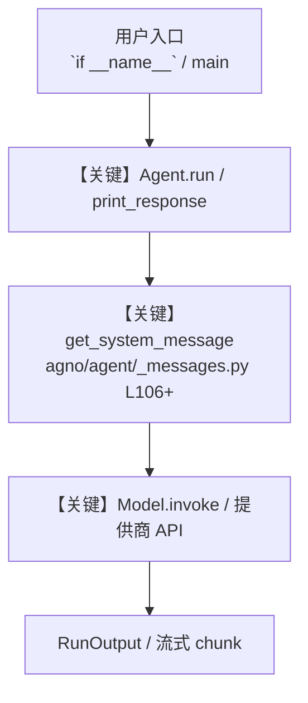

# cookbook_runner.py — 实现原理分析

<!-- cookbook-py-source:start -->
## 完整源码

```python
from __future__ import annotations

import json
import subprocess
import sys
import time
from datetime import datetime, timezone
from pathlib import Path

import click

try:
    import inquirer
except ImportError:  # pragma: no cover - optional dependency for interactive mode
    inquirer = None


SKIP_FILE_NAMES = {"__init__.py"}
SKIP_DIR_NAMES = {"__pycache__"}


def resolve_python_bin(python_bin: str | None) -> str:
    if python_bin:
        return python_bin
    demo_python = Path(".venvs/demo/bin/python")
    if demo_python.exists():
        return demo_python.as_posix()
    return sys.executable


def select_directory(base_directory: Path) -> Path | None:
    if inquirer is None:
        raise click.ClickException(
            "Interactive mode requires `inquirer`. Install it or use `--batch`."
        )

    current_dir = base_directory
    while True:
        items = [
            item.name
            for item in current_dir.iterdir()
            if item.is_dir() and item.name not in SKIP_DIR_NAMES
        ]
        items.sort()
        items.insert(0, "[Select this directory]")
        if current_dir != current_dir.parent:
            items.insert(1, "[Go back]")

        questions = [
            inquirer.List(
                "selected_item",
                message=f"Current directory: {current_dir.as_posix()}",
                choices=items,
            )
        ]
        answers = inquirer.prompt(questions)
        if not answers or "selected_item" not in answers:
            click.echo("No selection made. Exiting.")
            return None

        selected_item = answers["selected_item"]
        if selected_item == "[Select this directory]":
            return current_dir
        if selected_item == "[Go back]":
            current_dir = current_dir.parent
            continue
        current_dir = current_dir / selected_item


def list_python_files(base_directory: Path, recursive: bool) -> list[Path]:
    pattern = "**/*.py" if recursive else "*.py"
    files = []
    for path in sorted(base_directory.glob(pattern)):
        if not path.is_file():
            continue
        if path.name in SKIP_FILE_NAMES:
            continue
        if any(part in SKIP_DIR_NAMES for part in path.parts):
            continue
        files.append(path)
    return files


def run_python_script(
    script_path: Path, python_bin: str, timeout_seconds: int
) -> dict[str, object]:
    click.echo(f"Running {script_path.as_posix()} with {python_bin}")
    start = time.perf_counter()
    timed_out = False
    return_code = 1
    error_message = None
    try:
        completed = subprocess.run(
            [python_bin, script_path.as_posix()],
            check=False,
            timeout=timeout_seconds if timeout_seconds > 0 else None,
            text=True,
        )
        return_code = completed.returncode
    except subprocess.TimeoutExpired:
        timed_out = True
        error_message = f"Timed out after {timeout_seconds}s"
        return_code = 124
        click.echo(f"Timeout: {script_path.as_posix()} exceeded {timeout_seconds}s")
    except OSError as exc:
        error_message = str(exc)
        click.echo(f"Error running {script_path.as_posix()}: {exc}")

    duration = time.perf_counter() - start
    passed = return_code == 0 and not timed_out
    return {
        "script": script_path.as_posix(),
        "status": "PASS" if passed else "FAIL",
        "return_code": return_code,
        "timed_out": timed_out,
        "duration_seconds": round(duration, 3),
        "error": error_message,
    }


def run_with_retries(
    script_path: Path, python_bin: str, timeout_seconds: int, retries: int
) -> dict[str, object]:
    attempts = 0
    result: dict[str, object] | None = None
    while attempts <= retries:
        attempts += 1
        result = run_python_script(
            script_path=script_path,
            python_bin=python_bin,
            timeout_seconds=timeout_seconds,
        )
        if result["status"] == "PASS":
            break
        if attempts <= retries:
            click.echo(
                f"Retry {attempts}/{retries} for {script_path.as_posix()} after failure"
            )
    if result is None:
        raise RuntimeError(f"No execution result for {script_path.as_posix()}")
    result["attempts"] = attempts
    return result


def summarize_results(results: list[dict[str, object]]) -> dict[str, int]:
    passed = sum(1 for r in results if r["status"] == "PASS")
    failed = len(results) - passed
    timed_out = sum(1 for r in results if r["timed_out"])
    return {
        "total_scripts": len(results),
        "passed": passed,
        "failed": failed,
        "timed_out": timed_out,
    }


def write_json_report(
    output_path: str,
    base_directory: Path,
    selected_directory: Path,
    mode: str,
    recursive: bool,
    python_bin: str,
    timeout_seconds: int,
    retries: int,
    results: list[dict[str, object]],
) -> None:
    payload = {
        "generated_at": datetime.now(timezone.utc).isoformat(),
        "base_directory": base_directory.resolve().as_posix(),
        "selected_directory": selected_directory.resolve().as_posix(),
        "mode": mode,
        "recursive": recursive,
        "python_bin": python_bin,
        "timeout_seconds": timeout_seconds,
        "retries": retries,
        "summary": summarize_results(results),
        "results": results,
    }
    path = Path(output_path)
    path.parent.mkdir(parents=True, exist_ok=True)
    path.write_text(json.dumps(payload, indent=2) + "\n", encoding="utf-8")
    click.echo(f"Wrote JSON report to {path.as_posix()}")


def select_interactive_action() -> str | None:
    if inquirer is None:
        return None
    questions = [
        inquirer.List(
            "action",
            message="Some cookbooks failed. What would you like to do?",
            choices=["Retry failed scripts", "Exit with error log"],
        )
    ]
    answers = inquirer.prompt(questions)
    return answers.get("action") if answers else None


@click.command()
@click.argument(
    "base_directory",
    type=click.Path(exists=True, file_okay=False, dir_okay=True),
    default="cookbook",
)
@click.option(
    "--batch",
    is_flag=True,
    default=False,
    help="Non-interactive mode: run all scripts in the selected directory.",
)
@click.option(
    "--recursive/--no-recursive",
    default=False,
    help="Include Python scripts recursively under selected directory.",
)
@click.option(
    "--python-bin",
    default=None,
    help="Python executable to use. Defaults to .venvs/demo/bin/python if available.",
)
@click.option(
    "--timeout-seconds",
    default=0,
    show_default=True,
    type=int,
    help="Per-script timeout. Set 0 to disable timeouts.",
)
@click.option(
    "--retries",
    default=0,
    show_default=True,
    type=int,
    help="Number of retry attempts for failed scripts.",
)
@click.option(
    "--fail-fast",
    is_flag=True,
    default=False,
    help="Stop after the first failure.",
)
@click.option(
    "--json-report",
    default=None,
    help="Optional path to write machine-readable JSON results.",
)
def drill_and_run_scripts(
    base_directory: str,
    batch: bool,
    recursive: bool,
    python_bin: str | None,
    timeout_seconds: int,
    retries: int,
    fail_fast: bool,
    json_report: str | None,
) -> None:
    """Run cookbook scripts in interactive or batch mode."""
    if timeout_seconds < 0:
        raise click.ClickException("--timeout-seconds must be >= 0")
    if retries < 0:
        raise click.ClickException("--retries must be >= 0")

    base_dir_path = Path(base_directory)
    selected_directory = (
        base_dir_path if batch else select_directory(base_directory=base_dir_path)
    )
    if selected_directory is None:
        raise SystemExit(1)

    resolved_python_bin = resolve_python_bin(python_bin=python_bin)
    click.echo(f"Selected directory: {selected_directory.as_posix()}")
    click.echo(f"Python executable: {resolved_python_bin}")
    click.echo(f"Recursive: {recursive}")
    click.echo(f"Timeout (seconds): {timeout_seconds}")
    click.echo(f"Retries: {retries}")

    python_files = list_python_files(
        base_directory=selected_directory, recursive=recursive
    )
    if not python_files:
        click.echo("No runnable .py files found.")
        raise SystemExit(0)

    click.echo(f"Discovered {len(python_files)} script(s).")
    results: list[dict[str, object]] = []

    pending = python_files
    while pending:
        failures: list[Path] = []
        for script_path in pending:
            result = run_with_retries(
                script_path=script_path,
                python_bin=resolved_python_bin,
                timeout_seconds=timeout_seconds,
                retries=retries,
            )
            results.append(result)
            if result["status"] == "FAIL":
                failures.append(script_path)
                if fail_fast:
                    pending = []
                    break

        if not failures:
            break
        if batch:
            break

        click.echo("\n--- Error Log ---")
        for failure in failures:
            click.echo(f"- {failure.as_posix()}")

        action = select_interactive_action()
        if action == "Retry failed scripts":
            click.echo("Re-running failed scripts.")
            pending = failures
            continue
        break

    summary = summarize_results(results)
    click.echo(
        "Summary: "
        f"total={summary['total_scripts']} "
        f"passed={summary['passed']} "
        f"failed={summary['failed']} "
        f"timed_out={summary['timed_out']}"
    )

    if json_report:
        write_json_report(
            output_path=json_report,
            base_directory=base_dir_path,
            selected_directory=selected_directory,
            mode="batch" if batch else "interactive",
            recursive=recursive,
            python_bin=resolved_python_bin,
            timeout_seconds=timeout_seconds,
            retries=retries,
            results=results,
        )

    if summary["failed"] > 0:
        raise SystemExit(1)


if __name__ == "__main__":
    drill_and_run_scripts()
```

<!-- cookbook-py-source:end -->

> 源文件：`cookbook/scripts/cookbook_runner.py`

## 概述

`cookbook_runner.py`：演示 **（见源码 import）** 等与 Agno 模型的集成用法。

本示例归类：**脚本/工具入口**；模型相关类型：`（见源码 import）`。

**核心配置一览：**

| 配置项 | 值 | 说明 |
|--------|------|------|
| （见源码） | — | 请展开 `Agent` / `Team` 构造参数 |

## 架构分层

```
用户 / cookbook 示例              Agno 框架
┌──────────────────────┐         ┌────────────────────────────────┐
│ cookbook_runner.py   │  ──▶  │ Agent → get_run_messages → Model │
└──────────────────────┘         └────────────────────────────────┘
                                          │
                                          ▼
                                  ┌───────────────┐
                                  │ 对应 Model 子类 │
                                  └───────────────┘
```

## 核心组件解析

### 运行机制与因果链

1. **入口**：从模块 `__main__` 或暴露的 `agent` / `team` 调用进入；同步用 `print_response` / `run`，异步用 `aprint_response` / `arun`（若源码中有）。
2. **消息**：默认路径下 system 内容由 `get_system_message()`（`libs/agno/agno/agent/_messages.py` 约 **L106** 起）按分段逻辑拼装；若显式传入 `system_message` 则早退使用该字符串。
3. **模型**：具体 HTTP/SDK 形态以 `libs/agno/agno/models/` 下对应类的 `invoke` / `ainvoke` 为准（勿默认写成单一 `chat.completions`）。
4. **副作用**：若配置 `db`、`knowledge`、`memory`，运行会读写存储；仅以本文件为准对照。

### 与框架的衔接

- **System**：`get_system_message()` 锚点 `agno/agent/_messages.py` **L106+**。
- **运行**：`Agent.print_response` 等入口 `agno/agent/agent.py`（以当前仓库检索为准）。

## System Prompt 组装

| 序号 | 组成部分 | 本文件 | 是否生效 |
|------|---------|--------|---------|
| 1 | `instructions` / `description` 等 | 见核心配置表与源码 | 有赋值则生效 |
| 2 | 默认分段（markdown、时间等） | 取决于 `Agent` 默认与显式参数 | 视参数 |

### 拼装顺序与源码锚点

1. `system_message` 直给 → 使用该内容（见 `_messages.py` 文档字符串分支说明）。
2. 否则默认拼装：`description`、`role`、`instructions`、markdown 附加段等按 `# 3.x` 注释顺序合并。

### 还原后的完整 System 文本

```text
（本文件未出现 `Agent(...)` 构造；可能为脚本、工具封装或 MCP 服务，详见源码逻辑。）
```

### 段落释义（模型视角）

- 指令与安全边界由 `instructions` / `system_message` 约束；若带 `tools` / `knowledge`，文档中需体现「何时检索/调用」由框架注入的提示段支持。

## 完整 API 请求

```python
# 请以本文件实际 Model 为准打开 libs/agno/agno/models/<厂商>/ 下对应类的 invoke：
# 可能是 chat.completions.create、responses.create、Gemini generate_content 等。
```

> 与上一节 system 文本在同一 run 中组合；`developer`/`system` 角色由适配器转换。



**【关键】节点说明：**

- **print_response / run**：用户可见的同步入口。
- **get_system_message**：系统提示拼装核心。
- **Model.invoke**：对模型提供商的实际请求。

## 关键源码文件索引

| 文件 | 作用 |
|------|------|
| `agno/agent/_messages.py` | `get_system_message()` L106+ |
| `agno/agent/agent.py` | `Agent` 运行与 CLI 输出 |
| `agno/models/` | 各厂商 `Model.invoke` |
